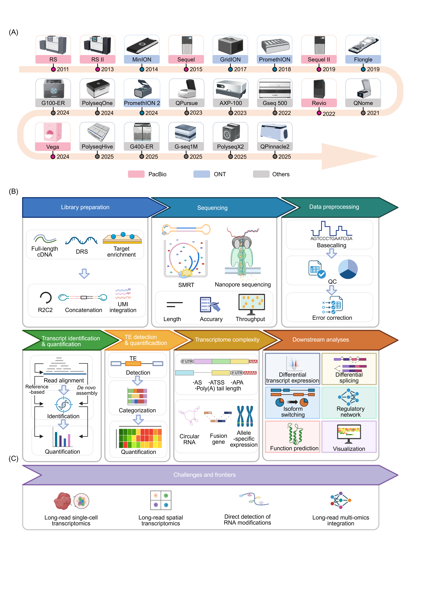

# INTRODUCTION

Transcriptomics is undergoing a major shift from gene-level measurement to transcript-level interpretation. For many years, short-read RNA sequencing (RNA-seq) has served as the gold standard for transcriptome analysis, enabling robust and scalable quantification of gene expression across conditions [[1]](../references.md#ref1), [[2]](../references.md#ref2). However, growing evidence shows that many key biological and disease-related processes are more directly reflected at the transcript level. Alternative splicing, alternative transcription start site (ATSS), alternative cleavage and polyadenylation (APA), gene fusion, transposable element (TE)-associated transcription, and allele-specific expression (ASE) often provide the most immediate link between regulatory variation and phenotypic diversity [[3]](../references.md#ref3), [[4]](../references.md#ref4), [[5]](../references.md#ref5), [[6]](../references.md#ref6). In cancer, pathogenic effects may arise from specific splice variants or abnormal fusions rather than total gene expression [[7]](../references.md#ref7), [[8]](../references.md#ref8). In complex systems such as the brain and immune system, differences in isoform usage often distinguish cell types and states more precisely than gene-level signals [[9]](../references.md#ref9), [[10]](../references.md#ref10).

This change in focus also highlights the limitations of second-generation sequencing (often referred to as next-generation sequencing, NGS) in terms of read length. Because NGS short reads capture only transcript fragments, full-length transcript reconstruction often relies on assembly and statistical inference, which can be challenging when isoforms share exons and splicing junctions are combinatorially used, or transcription occurs in repetitive regions [[11]](../references.md#ref11), [[12]](../references.md#ref12), [[13]](../references.md#ref13), [[14]](../references.md#ref14). As a result, short-read approaches remain highly effective for gene-level quantification, but are inherently constrained when the goal is to resolve transcript structures and isoform usage. More importantly, some transcriptomic features are not merely difficult to infer from short reads, but are fundamentally inaccessible or only indirectly observable, including RNA modifications, repeat- and TE-derived transcripts, complex fusion structures, and molecularly linked multiomic information [[14]](../references.md#ref14), [[15]](../references.md#ref15), [[16]](../references.md#ref16), [[17]](../references.md#ref17).

*Figure 1. A panoramic overview of long-read transcriptomics workflow. (A) Developmental timeline of LRS platforms from PacBio (pink), ONT (blue), and others (grey). (B) Overview of end-to-end workflow for LRS-based transcriptomics studies. (C) Frontiers of long-read transcriptomics toward single-cell, spatial, direct RNA, and multi-omics integration applications. PacBio: Pacific Biosciences; ONT: Oxford Nanopore Technologies; cDNA: complementary DNA; R2C2: Rolling Circle to Concatemeric Consensus; SMRT: single-molecule real-time sequencing; QC: quality control; UMI: unique molecular identifier; TE: transposable element.*

Long-read sequencing (LRS) offers a straightforward approach to bridge this gap (Figure 1A). By generating reads that span several kilobases or even full-length RNA molecules, LRS platforms make it possible to observe exon connectivity, transcript boundaries, and complex transcript structures within single molecules [[13]](../references.md#ref13), [[18]](../references.md#ref18). This greatly reduces the ambiguity that limits short-read analyses and provides a more direct foundation for transcript discovery, annotation improvement, and isoform-level quantification [[19]](../references.md#ref19), [[20]](../references.md#ref20). Beyond improving analyses that are already possible with short reads, LRS also enables fundamentally new biological measurements: direct RNA sequencing can preserve native RNA molecules and provide access to RNA modifications [[14]](../references.md#ref14), [[21]](../references.md#ref21); long reads can disambiguate transcripts arising from repetitive elements and improve TE-derived transcript quantification [[17]](../references.md#ref17), [[22]](../references.md#ref22); single-molecule reads can reveal fusion transcript architecture and isoform context [[23]](../references.md#ref23), [[24]](../references.md#ref24); and emerging long-read multiomic strategies can link transcript identity with additional molecular features in the same molecule or cell [[15]](../references.md#ref15), [[25]](../references.md#ref25), [[26]](../references.md#ref26).

Technologies such as Pacific Biosciences (PacBio) and Oxford Nanopore Technologies (ONT) have driven the rapid development of this field through full-length cDNA sequencing and direct RNA sequencing (DRS) strategies [[27]](../references.md#ref27), [[28]](../references.md#ref28). Meanwhile, several nanopore-based LRS platforms (e.g., QitanTech, CycloneSEQ and Axibo) are expanding the technological landscape and accelerating local deployment of long-read omics [[29]](../references.md#ref29), [[30]](../references.md#ref30), [[31]](../references.md#ref31). Although these emerging platforms are still being evaluated in terms of performance and best-practice workflows, they are broadening instrument choice, improving accessibility, and creating new opportunities for long-read transcriptome research. With continuing improvements in length, accuracy, throughput and cost, long-read transcriptomics is moving from a specialized approach for transcript discovery toward a practical tool for studying transcriptome complexity across diverse biological contexts [[32]](../references.md#ref32), [[33]](../references.md#ref33), [[34]](../references.md#ref34), [[35]](../references.md#ref35).

Despite its great promise, long-read transcriptomics remains technically complex and lacks standardized workflows. Its successful application requires both rigorous experimental design and careful computational analysis. Different platforms and library construction strategies, such as full-length cDNA versus DRS, amplification-based versus amplification-free protocol, and targeted versus whole-transcriptome workflow, can introduce distinct biases in read length, coverage, and error profile that propagate to affect transcript discovery [[36]](../references.md#ref36), [[37]](../references.md#ref37). Moreover, long-read data have different structure and noise properties from short-read data and require dedicated computational workflows for signal processing/basecalling, quality control, error correction, alignment, transcript reconstruction, annotation, and quantification. Downstream workflows for alternative splicing, fusion transcripts, allele-specific expression, circular RNAs, RNA modifications, and repeat-derived transcription add further complexity [[1]](../references.md#ref1), [[38]](../references.md#ref38). Although many tools and several benchmarking studies have emerged in recent years [[39]](../references.md#ref39), [[40]](../references.md#ref40), [[41]](../references.md#ref41), [[42]](../references.md#ref42), [[43]](../references.md#ref43), the field is still evolving rapidly, and performance trade-offs remain insufficiently characterized. Importantly, despite the enormous potential of long-read transcriptomics, there is still a lack of comprehensive resources that can guide researchers in a systematic way through the full workflow from experimental design to data interpretation.

In this review, we provide a practical end-to-end guide to long-read transcriptomics. We highlight the value of long-read RNA-seq for resolving transcriptome complexity and reveal molecular features that are difficult or impossible to access with short reads alone. We provide an integrated overview of long-read transcriptomics, covering key technologies, study design, library preparation, data processing, transcript identification, quantification, and downstream analysis (Figure 1B), while also discussing current challenges and future directions (Figure 1C). By bringing these aspects together within a unified framework, this review is intended to help researchers more effectively design, perform, and interpret long-read transcriptome studies.
