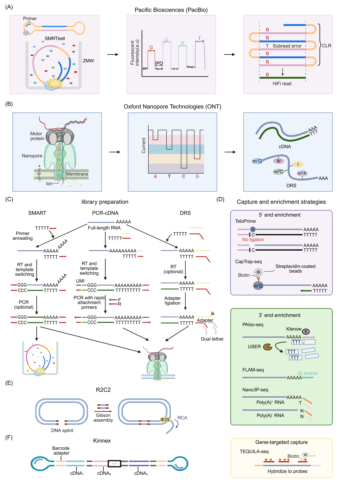

# TECHNOLOGIES: PLATFORMS, PROTOCOLS AND PERFORMANCE CHARACTERISTICS

## Long-read sequencing platforms

In addition to the two dominant LRS technologies (PacBio and ONT) that were commercialized in the 2010s, several new nanopore-based LRS platforms have emerged in recent years [[36]](../references.md#ref36), [[44]](../references.md#ref44). We first provide an overview of PacBio and ONT, followed by a brief discussion of these emerging platforms.

### Pacific Biosciences

As the earliest commercialized LRS technology, PacBio single-molecule real-time (SMRT) sequencing adopts a sequencing-by-synthesis principle similar to that used by Illumina [[45]](../references.md#ref45) (Figure 2A). Unlike Illumina's cluster-based amplification, PacBio enables polymerase-driven synthesis reactions within nanoscale zero-mode waveguides (ZMWs). ZMWs confine the detection volume to allow real-time monitoring of individual incorporation events [[46]](../references.md#ref46). PacBio employs a SMRTbell library, a circular DNA template formed by ligating hairpin adapters to both ends of a double-stranded DNA insert. This design allows a single polymerase to traverse the same DNA insert multiple times, thereby improving consensus accuracy. During nucleotide incorporation, fluorescent signals are recorded alongside interpulse duration (IPD), defined as the time interval between successive incorporation events [[47]](../references.md#ref47). IPD provides additional kinetic information context and helps infer DNA base modifications such as N^6^-methyladenine [[48]](../references.md#ref48).

Given that polymerase lifetime is finite and the SMRTbell library is circular, shorter DNA inserts yield more passes and thus higher consensus accuracy [[28]](../references.md#ref28). PacBio offers two core modes to meet diverse research needs. Continuous long reads (CLR), the initial mode, delivers ultra-long read length but suffers from a low number of passes per molecule and a high error rate, with errors distributed randomly. In contrast, high-fidelity (HiFi) mode, also known as circular consensus sequencing (CCS), takes shorter DNA templates as input, enabling the generation of multiple independent subreads for the same DNA insert.

PacBio established Iso-Seq as its flagship solution for comprehensive transcriptome analysis. This proprietary end-to-end protocol is specifically tailored for full-length transcript sequencing [[18]](../references.md#ref18). Conceptually, Iso-Seq directly leverages the HiFi mode: by converting reversed-transcribed full-length cDNA into a SMRTbell library and subjecting it to multiple passes of CCS, each transcript generates a highly accurate consensus read. To address the throughput limitations of standard Iso-Seq, a recent advancement named MAS-ISO-seq has been developed [[49]](../references.md#ref49). This method employs programmed cDNA concatenation, where multiple cDNA molecules are linked end-to-end prior to SMRTbell library preparation, allowing a single long HiFi read to cover several independent cDNA fragments. Consequently, MAS-ISO-seq substantially increases the number of transcripts sequenced per SMRT Cell, making full-length transcriptomics more scalable for population or cohort studies.

*Figure 2. Overview of LRS platforms and principles, and library preparation and enrichment strategies for transcriptomics studies. (A) For PacBio sequencing, a SMRTbell circular template is loaded into a ZMW and sequenced by polymerase; fluorescence pulses and IPD signals are recorded; and repeated passes produce multiple subreads to yield a consensus HiFi read. (B) For ONT sequencing, a motor protein controls strand translocation through a nanopore; the pore generates an ionic-current “squiggle” determined by local sequence context; and the squiggle is basecalled into sequence, while RNA base modifications could be retained in the raw signal when DRS is performed. (C) Three major workflows for long-read RNA-seq library preparation: SMART, ONT’s PCR-cDNA and DRS. (D) Representative capture and enrichment strategies: 5′-end enrichment (e.g., CapTrap-seq), 3′-end enrichment approaches (e.g., PAIso-seq), and gene-targeted capture (TEQUILA-seq). (E) R2C2: rolling-circle amplification creates repeated units that are sequenced and assembled into a higher-accuracy consensus sequence. (F) Kinnex: concatenation of multiple cDNA fragments into a single long template increases sequencing throughput.*

### Oxford Nanopore Technologies

Nanopore sequencing, pioneered by ONT, detects single-stranded DNA or RNA molecules by monitoring ionic-current disruptions as they translocate through a nanometer-scale pore embedded in a synthetic membrane (Figure 2B). Its principle is fundamentally different from the fluorescence-based detection used by PacBio and Illumina [[13]](../references.md#ref13), [[50]](../references.md#ref50), [[51]](../references.md#ref51).

The conceptual foundation of nanopore sequencing dates back to the 1980s [[52]](../references.md#ref52). In 1989, David Deamer formally proposed that individual nucleotides traversing a nanoscale channel would induce distinct, measurable obstructions in ionic flow [[50]](../references.md#ref50). This was experimentally validated in 1996 by John J. Kasianowicz using an α-hemolysin pore [[53]](../references.md#ref53). Building upon these breakthroughs, ONT was founded in 2005. ONT released the MinION in 2014, introducing the first portable nanopore sequencer to the scientific community [[54]](../references.md#ref54).

Two key components underpin nanopore sequencing: the pore protein (i.e., nanopore) that senses electrical current changes, and the motor protein that unwinds double-stranded molecules and controls the translocation speed of single-stranded DNA/RNA molecules through the nanopore [[55]](../references.md#ref55). In operation, a voltage is applied across an ion-conducting nanopore embedded in an electrically resistant synthetic membrane, producing a baseline ionic current. A motor protein with helicase activity unwinds double-stranded molecules into single strands and ratchets them through the nanopore at a constant speed. As the strand moves through the constriction zone, the nucleotide sequence modulates the ionic current [[51]](../references.md#ref51). Because the signal is primarily determined by a short sequence context (i.e., k-mer) residing in the constriction zone, each step of strand movement produces a characteristic squiggle transition [[56]](../references.md#ref56). These squiggle signals are translated into bases by probabilistic and deep-learning basecallers (e.g., Guppy (https://nanoporetech.com/zh/software/other/guppy, now upgraded to Dorado), Dorado (https://github.com/nanoporetech/dorado/) /Bonito (https://github.com/nanoporetech/bonito/)) trained for specific nanopore types and chemistries [[56]](../references.md#ref56), [[57]](../references.md#ref57).

In transcriptomics applications, ONT employs two major strategies: cDNA sequencing and DRS [[27]](../references.md#ref27). While DRS enables sequencing of native RNA molecules and direct detection of RNA modifications such as N^6^-methyladenosine (m^6^A), its adoption remains limited in practice due to higher RNA amount requirements, lower throughput, and increased susceptibility to 5' end truncation and RNA degradation. cDNA sequencing can be further divided into direct cDNA sequencing (no longer available) and PCR-amplified cDNA sequencing. PCR-amplified cDNA sequencing has become the dominant approach in most studies, offering greater sensitivity, robustness and compatibility with low-input samples. Direct cDNA sequencing without PCR was previously available but is no longer supported by ONT. Therefore, we focus primarily on PCR-cDNA workflows for data analysis in this review.

### Other long-read sequencing platforms

Beyond PacBio and ONT, several emerging LRS systems have been developed [[29]](../references.md#ref29), [[58]](../references.md#ref58), [[59]](../references.md#ref59), [[60]](../references.md#ref60). Most of these are nanopore-based and conceptually similar to ONT in that they rely on electrical signal sensing. While these platforms may broaden access and diversify the commercial supply of sequencing instruments, many of their performance metrics (e.g., sequencing length, accuracy and throughput) are still reported primarily by manufacturers and derived from early-stage studies [[61]](../references.md#ref61), [[62]](../references.md#ref62).

QitanTech (https://www.qitantech.com), Polyseq (https://www.polyseq.com/) and CycloneSEQ (https://www.cyclone-seq.com) share the same fundamental principle as ONT but employ different motor and pore proteins. QitanTech released its first sequencer QNome in 2021. Polyseq launched its first nanopore sequencer PolyseqOne in January 2024, building on its prior work in pore proteins (e.g., Opx). In late 2024, CycloneSEQ unveiled its first nanopore sequencer G100-ER (formerly WT02). CycloneSEQ distinguishes itself by mining deep-sea metagenomic databases to discover novel motor proteins (e.g., BCH-X) and pore proteins (e.g., BCH-Y) [[31]](../references.md#ref31).

Axbio (https://www.axbio.cn) and Geneus (http://www.geneus-tech.com) are also based on nanopore technology, yet they differ in pore protein design, signal detection system and base-calling algorithm compared with ONT. Both platforms integrate sequencing-by-synthesis with electrical detection, rather than optical readout. DNA polymerase and a nanopore are immobilized on the surface of a sequencing chip. As the DNA template is replicated, modified nucleotides carrying unique electroactive tags are incorporated one by one into the growing complementary strand. Upon incorporation, each tag passes through the nanopore, generating a characteristic change in an electrical property, which is detected in real-time by highly sensitive sensors embedded in the chip. These specific electrical signals are interpreted to determine the corresponding base. Axbio released its first long-read sequencer AxiLona AXP-100 in 2023. Similar to PacBio, Axbio uses circular DNA templates, enabling multiple reads of the same molecule to improve consensus accuracy. Geneus also launched its first long-read sequencer G-seq500 in 2023.

Roche's Sequencing by Expansion (SBX) represents an emerging long-read technology, which uses a biochemical conversion process to encode nucleic acid sequences into Xpandomer molecules to amplify sequence signals and overcome intrinsic signal-to-noise limitations [[63]](../references.md#ref63). The resulting Xpandomer is approximately 50 times longer than the parent template and incorporates high signal-to-noise reporter codes, enabling facile and accurate nanopore detection.

Element Biosciences (https://www.elementbiosciences.com/) offers a distinct long-read approach called LoopSeq [[64]](../references.md#ref64). Unlike the nanopore-based platforms described above, LoopSeq is a synthetic long-read approach. It fragments and barcodes long DNA molecules into shorter pieces, which are then sequenced on a short-read platform. Computational reassembly based on shared barcodes allows the reconstruction of the original long DNA molecules.

Together, these emerging LRS platforms diversify the technology landscape in terms of sequencing principles and chemistries, throughput, cost structure, and intended use cases. As their performance matures and supporting ecosystems develop, they may enable more routine deployment. However, independent benchmarking on their performance metrics, particularly for transcriptomics applications, remains limited, highlighting the need for rigorous evaluation in future studies.

## Library preparation strategies

LRS platforms lay the technical foundation for deciphering full-length transcriptomes, but library preparation is the pivotal factor that directly modulates the completeness and efficiency of full-length transcript capture. The overarching objective is to faithfully preserve the structural integrity of RNA molecules from the 5′ cap to the 3′ poly(A) tail [[2]](../references.md#ref2).

For full-length transcriptome sequencing, an end-to-end workflow for RNA preservation and handling should be established, including rapid stabilization or freezing, controlled cold-chain transport and RNase-minimizing procedures. For instance, bead-based extraction and cleanup methods (e.g., magnetic nanoparticles) can improve RNA integrity and reproducibility relative to phenol-chloroform workflows [[65]](../references.md#ref65). Prior to library preparation, it is advisable to assess RNA quantity using Qubit, quality using Nanodrop, and integrity using TapeStation (e.g., RIN and size distributions) [[66]](../references.md#ref66). With RNA preservation and quality control established, the next central decision is the choice of library preparation strategies: whether to convert RNA into full-length cDNA followed by DNA sequencing or to sequence the native RNA molecule directly (Figure 2C).

### Full-length cDNA generation

Converting RNA into full-length cDNA is the most widely adopted and robust framework for long-read transcriptomics studies. The switching mechanism at the 5′ end of RNA template (SMART) technology is widely used for full-length cDNA preparation [[67]](../references.md#ref67). The process begins with reverse transcription (RT) primed from the 3′ poly(A) tail. Upon reaching the 5′ cap, a specialized reverse transcriptase (e.g., MMLV, SuperScript II, Maxima H Minus) adds non-templated deoxycytidines via its terminal transferase activity [[68]](../references.md#ref68). A specially designed template-switching oligonucleotide (TSO) bearing a 3′ deoxyguanosine or locked nucleic acid-modified guanylate anneals to this overhang, allowing the reverse transcriptase to switch templates and continue synthesis to the end of the TSO [[69]](../references.md#ref69). Because template switching occurs efficiently only at authentic 5′ ends, prematurely terminated cDNAs are selectively excluded from subsequent amplification, inherently enriching the library for full-length clones [[70]](../references.md#ref70), [[71]](../references.md#ref71).

Compared with conventional full-length cDNA synthesis methods [[72]](../references.md#ref72) and earlier cap-dependent technologies (e.g., oligo-capping [[73]](../references.md#ref73), CAPture [[74]](../references.md#ref74), and CAP-trapper [[75]](../references.md#ref75)), SMART is a more streamlined approach that requires fewer enzymatic steps and circumvents cap degradation risks. SMART has been progressively optimized for low-input and even single-cell applications by Rickard Sandberg's group [[70]](../references.md#ref70), [[71]](../references.md#ref71), [[76]](../references.md#ref76). Commercial kits from Takara/Clontech for full-length cDNA preparation are built upon this core SMART principle [[69]](../references.md#ref69).

PacBio Iso-Seq adopts the SMART principle to generate full-length cDNA (Figure 2C) [[67]](../references.md#ref67). The amplified double-stranded cDNA is then converted into a SMRTbell library, a circular DNA template with hairpin adapters ligated to both ends. This conversion begins with DNA damage repair and end repair/A-tailing steps, which prepare the blunt-ended cDNA for adapter ligation. The prepared cDNA is then ligated to hairpin adapters. These adapters form the characteristic dumbbell-shaped structure, where the cDNA insert becomes a circular template flanked by hairpin loops. After adapter ligation, the library is purified using AMPure PB beads to remove unligated adapters and reaction byproducts. Optional size selection may be performed using systems like BluePippin to enrich for specific fragment length fractions (e.g., 1-3 kb, 3-6 kb, > 6kb) depending on the experimental objectives and research aims. This size selection helps optimize sequencing efficiency on early PacBio platforms (e.g., RS II) [[77]](../references.md#ref77), [[78]](../references.md#ref78). Finally, the purified library is annealed with sequencing primers, bound with DNA polymerase, and loaded for sequencing.

ONT cDNA sequencing library preparation follows a different workflow from PacBio Iso-Seq, as it produces a linear library suitable for nanopore sequencing. ONT offers two distinct cDNA sequencing approaches: PCR-cDNA sequencing and direct cDNA sequencing, which differ primarily in whether PCR amplification is included. Direct cDNA sequencing without PCR minimizes amplification-related biases (e.g., nucleotide misincorporation, short-transcript preference) and thus improves data quality [[79]](../references.md#ref79), [[80]](../references.md#ref80), while PCR-cDNA sequencing requires less RNA, facilitating effective sequencing for samples with limited materials (e.g., mammalian early embryos) [[81]](../references.md#ref81), [[82]](../references.md#ref82). Of note, PCR-cDNA sequencing is the primary method used by the community, and direct cDNA sequencing is no longer supported by ONT [[41]](../references.md#ref41), [[81]](../references.md#ref81). Therefore, we focus on PCR-cDNA library preparation below.

ONT PCR-cDNA library preparation (Figure 2C) consists of three main steps: RT and strand-switching, PCR amplification, and sequencing adapter attachment [[13]](../references.md#ref13). The RT step begins with the ligation of the cDNA RT adapter (CRTA) to the RNA template. The CRTA is a double-stranded adapter with a poly(T) overhang that anneals to the very end of the poly(A) tail of the RNA strand. This design ensures that the full length of the RNA is reverse transcribed and allows estimation of poly(A) length. Subsequently, the bottom strand of the ligated CRTA is digested so that the RT primer can bind the CRTA sequence as a primer for RT. First-strand cDNA synthesis is performed using Maxima H Minus. As the reverse transcriptase reaches the 5′ cap of the RNA, its terminal transferase activity adds non-templated deoxycytidines to the end of the newly synthesized cDNA [[69]](../references.md#ref69). The strand switching primer II (SSPII) base pairs to the deoxycytidine tail, allowing the reverse transcriptase to strand-switch for synthesis of the second cDNA strand. Double-stranded cDNA is then generated by PCR amplification using primers that contain 5′ tags which facilitate the ligase-free attachment of rapid sequencing adapters. PCR amplification is performed using LongAmp Hot Start Taq, which offers exceptional performance with long amplicons. The final step involves rapid adapter attachment, where the rapid adapter binds to the 5′ tags present on the amplified cDNA. For other LRS platforms that do not provide official cDNA sequencing library preparation kits or protocols, full-length double-stranded cDNA generated by SMART or other methods can be subjected to DNA sequencing library preparation. These platforms can treat the cDNA as standard DNA amplicons. Indeed, even for PacBio and ONT, once double-stranded cDNA is obtained, it can be processed through their standard DNA sequencing workflows, independent of the dedicated cDNA library preparation kits [[39]](../references.md#ref39), [[83]](../references.md#ref83).

### Direct RNA sequencing

Pioneered by ONT, DRS is a LRS strategy that directly reads native RNA molecules without the need for cDNA intermediates [[27]](../references.md#ref27), [[84]](../references.md#ref84). As a cornerstone technology for nanopore-based transcriptomics and epitranscriptomics studies [[50]](../references.md#ref50), DRS avoids the inherent loss of epigenetic information associated with cDNA conversion. Many studies established the feasibility of DRS: initial ONT research succeeded in the direct sequencing of yeast poly(A)^+^ RNA, followed by diverse RNA viruses (~3-11.5kb) such as SARS-CoV-2 subgenomic RNAs (~8.4 kb) [[27]](../references.md#ref27), [[85]](../references.md#ref85), [[86]](../references.md#ref86). Subsequently, sequencing of full-length E. coli 16S rRNA proved the technology's ability to detect specific known modification sites, such as m^7^G and pseudouridine [[86]](../references.md#ref86), [[87]](../references.md#ref87).

The canonical DRS library workflow relies on the poly(A) tail of RNA molecules: a duplex adapter with an oligo(dT) overhang is first ligated to the poly(A) tail of RNAs (Figure 2C) [[88]](../references.md#ref88). An optional RT step can be included to stabilize RNA structure and improve sequencing yield, though the sequencing template remains strictly RNA. A sequencing adapter pre-loaded with a motor protein is sequentially ligated. Following removal of free adapter using RNAClean XP beads, the prepared library is loaded for sequencing. During sequencing, the motor protein drives the RNA molecule through the nanopore in the 3′-5′ direction, generating characteristic ionic current signals. Basecalling algorithms subsequently reverse the data, displaying sequencing reads in the 5′-3′ direction.

Due to the 3′-5′ sequencing direction, premature termination or RNA degradation can result in loss of coverage at the 5′ end. Notably, DRS typically requires larger amounts of RNA (e.g., 300 ng poly(A)^+^ RNA) compared to PCR-cDNA sequencing (e.g., 10 ng poly(A)^+^ RNA), as DRS does not involve PCR amplification [[89]](../references.md#ref89), [[90]](../references.md#ref90).

### Enrichment strategies: from end integrity to targeted capture

In addition to the library preparation protocols officially released by PacBio and ONT, several third-party enrichment strategies have been developed: end-constrained strategies to prioritize intact transcript termini [[36]](../references.md#ref36), and gene-targeted capture to maximize detection sensitivity for predefined transcript panels [[91]](../references.md#ref91) (Figure 2D). Accurate characterization of full-length transcripts requires enrichment methods that selectively capture RNA molecules with intact 5′ caps and 3′ poly(A) tails, thereby effectively reducing degraded or prematurely terminated species.

Several techniques have been developed to enrich full-length RNA molecules with intact 5′ caps, such as TeloPrime and CapTrap-seq. TeloPrime, commercialized by Lexogen, employs a proprietary cap-dependent linker ligation (CDLL) mechanism in conjunction with long RT [[67]](../references.md#ref67). In this workflow, full-length cDNA synthesis is initiated by oligo(dT)-primed RT, generating a stable RNA-cDNA hybrid [[27]](../references.md#ref27). The CDLL reaction then utilizes a double-stranded adapter that base pairs atypically with the inverted guanosine of the 5′ cap structure. The 5′ linker is ligated only when an intact 5′ cap is present and the RT has reached the 5′ end of RNA, effectively excluding degraded RNAs or incomplete cDNAs.

CapTrap-seq builds on established Cap-trapping strategies [[75]](../references.md#ref75), [[92]](../references.md#ref92), [[93]](../references.md#ref93), [[94]](../references.md#ref94), but incorporates optimizations tailored for LRS [[95]](../references.md#ref95), [[96]](../references.md#ref96). Following poly(A) enrichment and anchored oligo(T)-primed first-strand synthesis, the initial round of full-length selection occurs via Cap trapping: the 5′ cap of intact RNA molecules is biotinylated, enabling streptavidin-mediated capture of capped full-length transcripts. An RNase treatment step then cleaves single-stranded RNA regions, removing uncapped RNAs. A second round of selection follows, involving double-stranded linker ligation dependent on both the 5′ cap and poly(A) tail structures, further enriching for complete cDNA molecules. Finally, PCR amplifies full-length templates with high fidelity. By employing two consecutive rounds of selection, CapTrap-seq effectively reduces 5′ truncation artifacts. Of note, CapTrap-seq requires a high starting total RNA input (5 μg) and involves a relatively complex multi-stage procedure that favors the detection of shorter RNA molecules.

Despite their superior 5′ end fidelity, TeloPrime and CapTrap-seq are constrained by their reliance on oligo(dT) priming, which can induce internal priming at A-rich sequences within the transcript body, and cannot preserve the complete poly(A) tail at the 3′ end [[97]](../references.md#ref97). To address these limitations, several poly(A) tail-focused enrichment strategies have been developed, such as PAIso-seq, FLAM-seq, and Nano3P-seq [[98]](../references.md#ref98).

PAIso-seq circumvents conventional poly(A) magnetic bead enrichment and instead employs a dU-modified oligo(dT) probe with Klenow fragment extension to capture poly(A) tails, thereby minimizing systematic biases against long poly(A) tails caused by the low binding efficiency of magnetic beads to long poly(A) structures [[99]](../references.md#ref99), [[100]](../references.md#ref100). Subsequent USER enzyme cleavage degrades the probe, preventing pseudopriming and tail truncation [[99]](../references.md#ref99), [[101]](../references.md#ref101). RT and template switching are then performed to generate cDNA. Following PCR amplification, the SMRTbell library is prepared and sequenced on the PacBio platform. At single-molecule resolution, PAIso-seq jointly resolves full-length transcript isoform architecture and poly(A) tail phenotypes, including tail length dynamics and embedded non-A residues [[99]](../references.md#ref99), [[100]](../references.md#ref100). With rigorously validated subnanogram-level RNA compatibility, it is broadly applicable across sample types, including extremely low-input in vivo specimens [[100]](../references.md#ref100).

FLAM-seq is also designed to capture full-length transcripts alongside their poly(A) tails. In this workflow, poly(A) RNAs are enzymatically tailed with a short guanosine/inosine segment, which serves as an anchoring site for oligonucleotides bearing unique molecular identifiers (UMIs) and PCR handles. RT is then performed in conjunction with a chemically modified TSO that tags the 5′ ends of RNA molecules with a second PCR handle. After PCR amplification, the SMRTbell library is prepared and subjected to PacBio sequencing. FLAM-seq's primary advantage lies in the joint measurement of the transcript body and the 3′ poly(A) tail within a contiguous long read, enabling the mapping of tail-length dynamics to specific transcript classes, UTR architectures, and APA events [[102]](../references.md#ref102).

Distinct from CapTrap-seq and FLAM-seq that are focused on poly(A)+ RNAs, Nano3P-seq broadly enhances the recovery of transcript 3′-end information, encompassing both polyadenylated and non-polyadenylated transcripts [[103]](../references.md#ref103). By optimizing the initiation steps, it circumvents the need for 3′ end-conjugation ligation or second-strand cDNA synthesis. Empirical evidence demonstrates that Nano3P-seq introduces minimal library preparation bias, making it highly suitable for whole-transcriptome composition analysis and the comparative evaluation of 3′ end processing across diverse RNA classes [[104]](../references.md#ref104). Notably, an alternative approach for sequencing non-polyadenylated RNAs involves exogenous enzymes (e.g., E. coli Poly(A) polymerase) to add poly(A) tails, followed by standard poly(A)-dependent library preparation for LRS [[105]](../references.md#ref105), [[106]](../references.md#ref106).

To reduce sequencing cost and focus on specific transcripts of interest, targeted capture approaches for LRS have been developed, such as TEQUILA-seq, ORF Capture-Seq, RNA Capture Long Seq, Multiplexed Targeted Sequencing and combining long-range RT-PCR with ONT [[107]](../references.md#ref107), [[108]](../references.md#ref108), [[109]](../references.md#ref109), [[110]](../references.md#ref110). TEQUILA-seq is a cost-effective, scalable targeted long-read RNA-seq strategy for candidate gene sets or specific biological pathways. It uses nicking endonuclease-triggered isothermal strand displacement and amplification with only a limited set of initial oligonucleotides, efficiently generating customizable biotinylated probes to capture targeted transcripts. Combined with ONT for enriched cDNA sequencing, it exhibits high capture efficiency, specificity, and uniform target enrichment across gene panels of varying sizes [[91]](../references.md#ref91). Additionally, TEQUILA-seq can be easily adapted into a method for sequencing all non-polyadenylated transcripts via a simple polyadenylation process, and subsequent design of targeted probes for non-polyadenylated transcripts of different lengths will further enhance its utility [[111]](../references.md#ref111), [[112]](../references.md#ref112). For studies with constrained sequencing budgets focusing on isoform dynamics in a defined gene panel, targeted enrichment increases the on-target read fraction, improving the detection sensitivity and quantitative robustness of rare isoforms, low-abundance splicing events, and condition-specific transcripts. As a key precision medicine approach, it facilitates the dissection of autoimmune diseases, optimization of cancer treatment, and guidance of vaccine development [[113]](../references.md#ref113).

## Performance characteristics and optimization strategies of RNA sequencing

### Length

By "length", we refer to the length of the raw reads output by the sequencer. In contrast to short reads of NGS, LRS platforms produce substantially longer reads, with continuous improvements being made over the years. For transcriptomics, both PacBio and ONT can capture full-length transcripts for the vast majority of RNA biotypes, as most transcripts are less than 10 kb (typically 1-2 kb in human and mouse) [[39]](../references.md#ref39), while the performance of other LRS platforms remains to be assessed. Here, we focus on the sequencing lengths achieved by LRS platforms in the context of genome sequencing. PacBio platforms typically generate reads of 10-30 kb, with consensus sequence length strongly dependent on library insert size and the sequencing strategies employed (CLR or HiFi modes) [[48]](../references.md#ref48). For ONT-based genome sequencing, read length is largely determined by the length and integrity of the extracted genomic DNA. The typical read lengths range from 5 to 50 kb [[114]](../references.md#ref114), while the longest reported reads reached 2.3 Mb in a third-party study [[115]](../references.md#ref115) and 4.2 Mb in-house at ONT. Despite the multi-kilobase capabilities of PacBio and ONT, library preparation biases (e.g., RNA fragmentation during RT, size selection, preferential amplification of shorter molecules) systematically underrepresent very long transcripts (e.g., >10 kb).

Although other LRS platforms claim the ability to generate long reads (e.g., >100 kb), independent third-party evaluations are lacking. As reported in 2022, QitanTech's QNome platform achieved read lengths of up to ~150 kb [[30]](../references.md#ref30). CycloneSEQ has reported a mean read length of 19.2 kb in human whole-genome sequencing [[31]](../references.md#ref31). In the future, it will be necessary to assess whether these platforms can reliably capture the 5′ and 3′ ends of transcripts, as many sequencing techniques suffer from signal noise that obscures terminal regions. Benchmarking studies assessing end-to-end coverage across full-length transcripts are therefore essential.

### Accuracy

By "accuracy", we refer to the accuracy of base calling. LRS platforms suffer higher error rates compared with NGS. PacBio's CLR mode can generate ultra-long reads but has a high error rate of ~13% [[116]](../references.md#ref116), whereas its HiFi mode routinely achieves >99.9% consensus sequence accuracy [[18]](../references.md#ref18). Historically, early ONT runs exhibited high error rates between 15%–40% [[114]](../references.md#ref114), [[117]](../references.md#ref117). To address this, ONT continuously updated its sequencing chemistries (nanopore and motor protein) and library preparation methods. Early library strategies like 2D and 1D² attempted to sequence both strands of a duplex to improve consensus accuracy (reaching ~94%) [[118]](../references.md#ref118), but were discontinued, making 1D sequencing the standard [[118]](../references.md#ref118), [[119]](../references.md#ref119), [[120]](../references.md#ref120). Accuracy improvements have also relied on chemistry evolution: from early versions (R6, R7) to the R9 series, which achieved ~85–94% accuracy [[62]](../references.md#ref62), [[121]](../references.md#ref121). However, the R9 pore struggled with homopolymeric regions because its sensing zone read approximately five nucleotides simultaneously, reducing signal discrimination [[61]](../references.md#ref61), [[122]](../references.md#ref122). To overcome this, the R10 series introduced a dual-constriction sensing region [[61]](../references.md#ref61), [[123]](../references.md#ref123), [[124]](../references.md#ref124). Combined with advanced basecalling algorithms, R10.4.1 reads achieved a median raw-read identity of 98.8% [[122]](../references.md#ref122), [[125]](../references.md#ref125). Despite these substantial improvements, ONT generally still trails PacBio HiFi in single-read accuracy. Mismatches remain the predominant error type in ONT data, featuring strong context specificity, while insertion and deletion errors are heavily biased towards homopolymeric regions [[126]](../references.md#ref126).

To improve accuracy, the Rolling Circle to Concatemeric Consensus (R2C2) method was developed to leverage the long sequencing lengths of the ONT platform for generating consensus sequences with higher accuracy (Figure 2E). R2C2 introduces pre-sequencing redundancy by circularizing full-length cDNAs and amplifying them via Phi29-mediated rolling circle amplification (RCA) into long concatemers with multiple tandem repeats of the target insert [[127]](../references.md#ref127), [[128]](../references.md#ref128). It combines RCA with concatemeric consensus calling: parsing and collapsing these repeat units into high-accuracy consensus sequences post-sequencing. This approach reduces random sequencing errors and minimizes interference from truncated molecules in the final dataset [[39]](../references.md#ref39). R2C2 achieves a reported median read accuracy of ~94% compared to 87% of ONT 1D reads [[128]](../references.md#ref128). This accuracy gain comes with a trade-off of reduced effective sequencing depth and throughput, as sequencing capacity is used to generate the redundant repeats required for consensus calling. Nevertheless, R2C2 features high multiplexing potential, cost-effectiveness, and compatibility with established cDNA workflows, supporting its use in both bulk and single-cell full-length transcriptome analyses [[39]](../references.md#ref39), [[127]](../references.md#ref127).

In terms of DRS data accuracy, it has improved from 87-92% with the early RNA001 and RNA002 chemistries to 93.5% with the latest RNA004 chemistry [[129]](../references.md#ref129). This improvement stems from optimized chemistries and enhanced basecalling models tailored for RNA signals, although DRS accuracy still trails ONT DNA sequencing and PacBio HiFi.

### Throughput

By "throughput", we refer to the number of sequenced reads produced per experimental run. To accommodate diverse research demands and reduce sequencing cost, LRS companies have released different devices/platforms with different throughput capacities (Figure 1A).

ONT offers a range of sequencers: MinION (low throughput), GridION (medium) and PromethION (high) [[13]](../references.md#ref13). MinION is a portable device that can run a MinION flow cell featuring 512 channels, each with one active nanopore, enabling concurrent sequencing of up to 512 molecules [[118]](../references.md#ref118), [[130]](../references.md#ref130). The Flongle flow cell, with 126 channels, is for smaller-scale applications. GridION is a medium-scale device capable of running five MinION flow cells simultaneously. PromethION accommodates 24 or 48 parallel PromethION flow cells, each containing 2675 channels, with the yield per PromethION flow cell approximately five times that of a MinION flow cell [[50]](../references.md#ref50). A single PromethION flow cell typically produces 50-150 gigabases (Gb) of data for PCR-cDNA sequencing (50-150 million reads with an average length of ~1 kb per read) and 10-30 Gb of data for DRS (10-30 million reads with an average length of ~1 kb per read) [[131]](../references.md#ref131), [[132]](../references.md#ref132). Future strategies to increase ONT throughput may involve new motor proteins with higher translocation speeds, though this could potentially compromise accuracy.

PacBio has progressively upgraded its devices to increase throughput, evolving from the initial RS (150,000 ZMWs) and RS II (150,000 ZMWs) to the Sequel (1 million ZMWs), Sequel II (8 million ZMWs), and the latest high-throughput Vega (25 million ZMWs) and Revio (25 million ZMWs) [[133]](../references.md#ref133). Revio system can run four SMRT Cells, totaling 100 million ZMWs [[134]](../references.md#ref134). Since each ZMW can be used to sequence one molecule per run, read count serves as a more informative metric for PacBio throughput. Because the SMRT Cell cannot be overloaded, the proportion of ZMWs that successfully undergo sequencing is about 40-60% [[45]](../references.md#ref45). A typical Revio or Vega SMRT Cell yields 6-8 million HiFi reads [[49]](../references.md#ref49). In the traditional PacBio Iso-Seq workflow, cDNA templates are far shorter than the platform's maximum read length, leading to substantial waste of capacity utilization, as each ZMW sequences only one molecule [[135]](../references.md#ref135), [[136]](../references.md#ref136). Therefore, developing library preparation strategies that boost throughput while preserving the long-read advantages of PacBio has become critical for promoting its large-scale applications.

Although platform throughput defines the upper bound of sequencing output, the required sequencing depth for LRS transcriptomics is highly dependent on the biological question and transcriptome complexity. For bulk isoform-level quantification in human or other complex transcriptomes, approximately 10 million high-quality long reads per sample are generally considered sufficient to recover a large fraction of known isoforms, with diminishing returns beyond this point for annotated isoform detection [[137]](../references.md#ref137), [[138]](../references.md#ref138). However, rare transcript detection, novel isoform discovery and accurate quantification of lowly expressed isoforms require substantially deeper sequencing, typically >20 million high-quality long reads per sample or >40× transcriptome depth, and even higher depths may be needed for highly complex tissues, tumors, developmental samples or poorly annotated organisms [[139]](../references.md#ref139), [[140]](../references.md#ref140). Therefore, subsampling-based saturation analyses are recommended to define the optimal library size for each study [[18]](../references.md#ref18), [[39]](../references.md#ref39), [[141]](../references.md#ref141). These recommendations should also be interpreted cautiously because benchmarking for newer ONT R10.4 flow cells and chemistries is still ongoing, and standardized depth guidelines for single-cell and spatial long-read transcriptomics remain under active development owing to their dependence on cell or spot number, capture efficiency, barcode recovery and reads per cell or spot.

Kinnex, a recent advancement in the PacBio sequencing ecosystem, is the commercial implementation of Multiplex Any Sequence (MAS-Seq, termed MAS-ISO-seq when applied to transcriptome sequencing) principles for substantial throughput enhancement [[49]](../references.md#ref49), [[142]](../references.md#ref142) (Figure 2F). The core mechanism of Kinnex/MAS-ISO-seq involves concatenating multiple short cDNA fragments (eight fragments in the current version of Kinnex) into segmented long templates (15–20 kb) using dedicated adapters, adapted from the deoxy-uracil (dU) barcode adapter technology of MAS-ISO-seq [[49]](../references.md#ref49). Following sequencing, the long templates are bioinformatically demultiplexed to recover the sequence information of individual short cDNA templates without compromising integrity or accuracy. Kinnex maintains PacBio's hallmark HiFi accuracy (99.9%) while delivering an 8-fold throughput increase for transcriptome sequencing [[142]](../references.md#ref142), [[143]](../references.md#ref143). Leveraging the same cDNA concatenation strategy, HIT-scISOseq is a specialized high-throughput single-cell transcriptome sequencing method developed for PacBio. A single Sequel II SMRT Cell 8M processed with HIT-scISOseq can generate more than 10 million high-accuracy reads [[144]](../references.md#ref144).

Other LRS companies have also released devices with varying throughputs. QitanTech offers QNome (low), QPursue (medium) and QPinnacle (high). CycloneSEQ has released G100-ER (medium) and G400-ER (high). Polyseq provides PolyseqOne (low), PolyseqHive (medium) and PolyseqX2 (high). Geneus offers G-seq500 (low) and G-seq1M (high). Although these companies claim that their platforms can generate various throughputs, the quantity and quality of sequencing data remain to be evaluated by independent third-party studies in the future.
