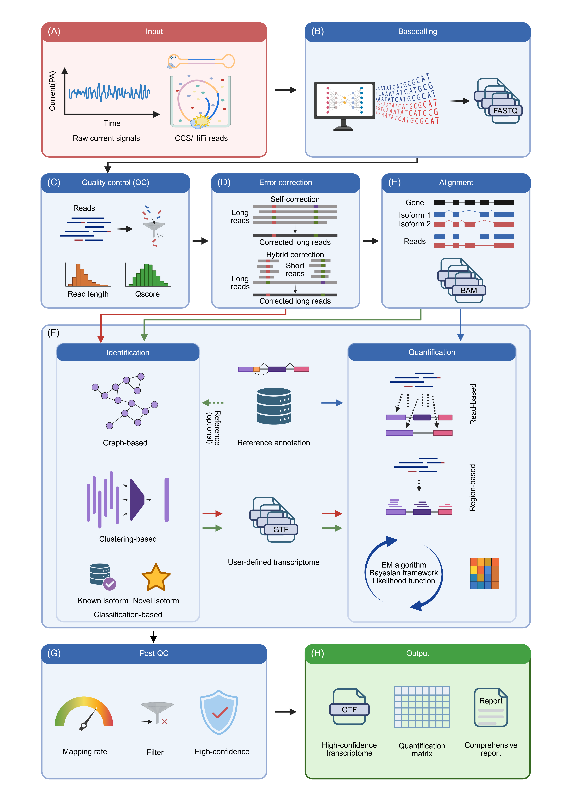
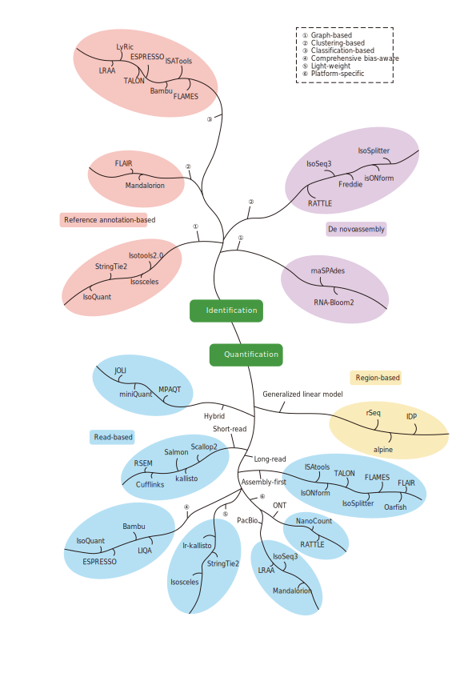
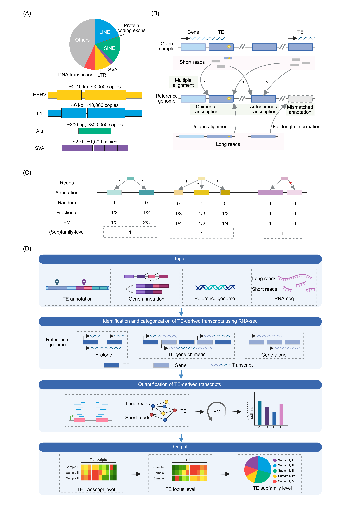
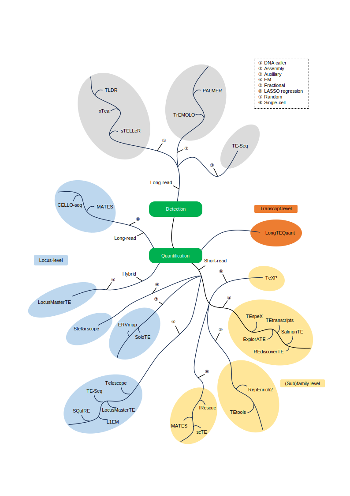

# BIOINFORMATICS METHODS: FROM RAW SIGNALS TO TRANSCRIPTS

## Data preprocessing: basecalling, quality control and error correction

Primary data processing mainly encompasses basecalling, quality control (QC), and error correction, serving as a critical intermediate step that bridges raw sequencing data (Figure 3A) and downstream analyses.

*Figure 3. Computational workflow for long-read transcriptome data analysis. (A) Raw sequencing signals such as current signals generated by ONT platforms. (B) Basecalling converts raw electrical signals into nucleotide sequences in FASTQ format. (C) Quality control (QC) filters reads according to quality-related metrics, such as read length and Q-scores, to remove low-quality sequences before downstream analysis. (D) Alignment maps high-quality reads to a reference, typically a reference genome, to produce alignment files (BAM) and to resolve exon–intron structures and isoform-specific read mappings. (E) Transcript identification and quantification can be executed through three distinct strategies, indicated by colored arrows. The red pathway represents a reference-free inference strategy, which directly employs quality-controlled reads for de novo transcript reconstruction and quantification without requiring a reference genome alignment, making it particularly suitable for species lacking reference genomes. The green pathway illustrates a reference-based inference approach, where aligned reads are utilized to infer transcript models via graph-based, clustering-based, or classification-based methods. This strategy distinguishes between known and novel isoforms, generating a user-defined transcriptome (GTF) for subsequent quantification. The blue pathway depicts an annotation-driven method, which bypasses the novel transcript identification step and directly quantifies expression based on existing reference annotations; this provides a more computationally efficient route but precludes the discovery of novel isoforms. During the identification process, reference annotation can optionally be used to guide transcript model construction. Quantification relies on read-based or region-based strategies and commonly uses probabilistic frameworks, such as expectation–maximization (EM) algorithms, Bayesian models, or likelihood-based inference, to generate expression estimates. (F) Post-QC evaluates mapping and quantification results using metrics such as mapping rate, mapping quality thresholds (MAPQ), and confidence filters to retain high-confidence transcript models and expression estimates. (G) The final outputs include a high-confidence transcriptome annotation (GTF), a transcript/isoform quantification matrix, and a comprehensive analysis report.*

### Basecalling

The basecalling of PacBio and ONT starts from fundamentally different signal modalities, which drives different algorithmic priorities (Figure 3B). ONT converts raw ionic-current time series generated as RNA or DNA molecules translocate through a nanopore into nucleotide sequences. Because each current state reflects a short local sequence context rather than a single nucleotide, basecalling is best framed as decoding a noisy continuous signal into a discrete sequence [[13]](../references.md#ref13). Accordingly, ONT has evolved from event segmentation plus Hidden Markov Model (HMM)-based decoding to end-to-end deep learning directly on raw signals, including Convolutional Neural Networks (CNN) [[145]](../references.md#ref145), Recurrent Neural Networks (RNN) [[146]](../references.md#ref146), attention-based networks [[147]](../references.md#ref147), and Transformer models [[148]](../references.md#ref148), typically combined with Connectionist Temporal Classification-style decoding [[149]](../references.md#ref149). PacBio SMRT, by contrast, records optical pulses and polymerase-kinetic signals during synthesis; in RNA applications it is used mainly via Iso-Seq full-length cDNA. Here, basecalling is closely coupled to CCS: multiple subreads from the same molecule are aggregated into a high-accuracy HiFi read [[150]](../references.md#ref150). As a result, ONT progress is largely driven by better single-pass signal decoding, whereas PacBio accuracy is primarily determined by multi-pass consensus generation, increasingly improved by deep learning-based consensus refinement (e.g., DeepConsensus [[151]](../references.md#ref151)).

Algorithmically, ONT basecalling can be organized into three practical classes. First, event-level HMM approaches [[152]](../references.md#ref152), [[153]](../references.md#ref153) are relatively interpretable but can be limited by information loss introduced during segmentation. Second, raw-signal deep learning methods (CNN [[145]](../references.md#ref145)/RNN [[146]](../references.md#ref146)/temporal convolutional network [[154]](../references.md#ref154)/Transformer [[148]](../references.md#ref148)/Conformer families [[149]](../references.md#ref149)) substantially improve accuracy by capturing both local patterns and longer-range dependencies, but they require more computation and careful matching to pore chemistry, library type, and training domain. Third, modification-aware frameworks [[155]](../references.md#ref155) infer RNA modifications from signal features during or immediately after basecalling; this is a major advantage for DRS, but performance can be sensitive to training data, chemistry, and sequence context. In the current ONT ecosystem, Dorado (https://github.com/nanoporetech/dorado/) is a widely used and optimized baseline, while third-party tools such as RODAN [[156]](../references.md#ref156), Coral [[157]](../references.md#ref157), SqueezeCall [[149]](../references.md#ref149), BaseNet [[148]](../references.md#ref148), DemuxTrans [[158]](../references.md#ref158), DEMINERS [[159]](../references.md#ref159), and GCRTcall [[160]](../references.md#ref160) explore alternative architectures and may outperform on specific datasets (several are designed for DRS). For PacBio, the most useful distinction is between standard signal decoding followed by CCS/HiFi consensus generation and deep learning-enhanced consensus refinement (notably DeepConsensus [[151]](../references.md#ref151)). This consensus-centric strategy yields very high final read accuracy, which is particularly beneficial for splice-junction precision, isoform reconstruction, and transcript annotation, but it is generally less direct than ONT for native RNA modification analysis.

Practically, in ONT RNA-seq workflows, Dorado (https://github.com/nanoporetech/dorado/) is a strong default given its accuracy, speed, hardware optimization, and support for duplex and modified-base calling; third-party basecallers are best treated as task-specific options and adopted only when benchmarking on the target sample type (e.g., DRS, mixed-species mixtures, or unusual taxa) demonstrates a clear advantage. PacBio RNA-seq workflows should prioritize the latest CCS/HiFi pipeline and incorporate DeepConsensus [[151]](../references.md#ref151) when available, because consensus quality is the main determinant of downstream performance. Overall, PacBio is typically preferred when maximum sequence accuracy and isoform resolution are the primary goals, whereas ONT is often preferred for native RNA sequencing and modification-aware applications.

### Quality control

Although recent technological advances have markedly reduced per-read error rates, long-read platforms still exhibit platform-specific biases and technical variability. Therefore, rigorous QC workflows and effective data visualization, spanning raw data assessment to transcriptome assembly, remain essential to ensure reliable downstream analyses (Figure 3C).

Raw read QC is the first step of long-read transcriptome analysis. Common cross-platform metrics include total yield, read length distribution, base quality scores, GC content, and adapter/primer contamination [[161]](../references.md#ref161). Transcriptome-oriented libraries benefit from additional checks for full-length enrichment and chimeric artifacts. Platform-specific indicators further improve interpretability [[127]](../references.md#ref127). In PacBio Iso-Seq, the fraction of full-length non-chimeric (FLNC) reads is a key measure of library quality and size-selection performance [[162]](../references.md#ref162). In ONT, time-resolved yield and sequencing-summary statistics are useful for diagnosing loading efficiency, pore performance, and run stability [[163]](../references.md#ref163).

To interpret QC metrics effectively, one must understand the failure modes each indicator reveals. For long-read transcriptome data, common issues manifest as distinct signatures. A sharp drop in read length compared to expected insert size often points to shearing during library preparation or suboptimal size selection. An excess of very short reads (<500 bp) alongside low FLNC fractions suggests RNA degradation or inefficient RT.

QC tools can be selected based on function and platform. For consistency, reference-free summaries across ONT and PacBio, LongQC [[161]](../references.md#ref161) and LongReadSum [[164]](../references.md#ref164) provide core statistics on yield, read length, and quality distributions. For visualization, NanoPack2 (including NanoPlot and related modules) [[165]](../references.md#ref165) generates standard plots such as read-length histograms, length-quality scatter plots, GC-content distributions, and yield-over-time profiles, which makes it easier to spot outliers and compare runs. For ONT-specific monitoring and reporting, MinKNOW [[166]](../references.md#ref166) supports real-time run tracking and control, while pycoQC [[167]](../references.md#ref167) converts sequencing summary files into interactive HTML reports for post-run review. For preprocessing that combines QC with cleaning, fastplong [[168]](../references.md#ref168) (<https://github.com/OpenGene/fastplong>) integrates QC reporting with read filtering, adapter trimming, and poly(A)-tail processing, which is well suited to full-length cDNA and transcriptome-focused workflows.

In practice, a robust default is to apply a cross-platform summary tool (LongQC [[161]](../references.md#ref161) or LongReadSum [[164]](../references.md#ref164)) and a visualization tool (NanoPlot [[165]](../references.md#ref165)) to every dataset to establish a comparable QC baseline. For ONT data, include MinKNOW [[166]](../references.md#ref166) during sequencing and pycoQC [[167]](../references.md#ref167) after sequencing to evaluate run health and diagnose common failure modes; use fastplong [[168]](../references.md#ref168) (<https://github.com/OpenGene/fastplong>) when trimming, filtering, or poly(A) processing is required before mapping or assembly. For PacBio Iso-Seq, prioritize FLNC-related checks from the standard Iso-Seq processing outputs, and complement them with LongQC/LongReadSum plus NanoPlot to confirm that yield, length, and quality distributions match expectations. This combination ensures that QC remains both platform-aware and end-to-end, reducing the risk that early technical issues compromise transcriptome reconstruction and downstream interpretation.

### Error correction

LRS provides exceptional structural resolution, but raw reads can still carry substantial errors, often enriched for insertions and deletions [[169]](../references.md#ref169). Error profiles differ across platforms (more random in PacBio, more sequence- and context-biased in ONT), and low-accuracy read subsets can persist even when average accuracy improves [[170]](../references.md#ref170). Without correction, these errors reduce mappability, blur splice junctions and breakpoints, inflate spurious isoforms, and increase misassemblies, ultimately compromising downstream inference [[171]](../references.md#ref171). Signal level correction is addressed in the basecalling section, here we focus on correction methods that take only sequence as input.

Methodologically, correction tools can be grouped by the information they exploit and the model used to derive a consensus. Hybrid correction uses accurate short reads and typically achieves the lowest residual error; alignment-based methods (e.g., PacBioToCA [[172]](../references.md#ref172), proovread [[173]](../references.md#ref173) and Hercules [[174]](../references.md#ref174)) are accurate but can be computationally heavy and sensitive to ambiguous mappings, whereas de Bruijn graph-based methods (e.g., LoRDEC [[175]](../references.md#ref175), Jabba [[176]](../references.md#ref176), FMLRC [[171]](../references.md#ref171) and HALC [[177]](../references.md#ref177)) are often more scalable but depend on sufficient short-read depth and can be challenged by repeats and complex variation. Self-correction relies only on long reads, using overlap-consensus approaches (e.g., Canu [[178]](../references.md#ref178), MECAT/NECAT [[179]](../references.md#ref179), CONSENT [[180]](../references.md#ref180) and NextDenovo [[181]](../references.md#ref181)) or graph-based strategies (e.g., LoRMA [[182]](../references.md#ref182)); it enables long-read-only workflows but usually leaves higher residual error, particularly when systematic ONT errors dominate.

For UMI-tagged single-cell and spatial protocols, error correction can additionally leverage molecule-level redundancy, but the effectiveness depends critically on how UMIs are recovered and utilized [[183]](../references.md#ref183). In principle, collapsing reads originating from the same UMI reduces both sequencing and PCR errors [[184]](../references.md#ref184); however, UMI recovery itself is non-trivial in long-read data due to sequencing errors that can fragment true UMI groups [[185]](../references.md#ref185). Recent methods have been developed to address this challenge, see later discussion under single cell long read sequencing. With the recovered UMI, mapping and truncation errors in the sequencing reads can be corrected assignment of reads to UMI groups and majority vote within each UMI group [[186]](../references.md#ref186).

In practice, the choice of long-read error correction should be driven by data availability, platform error characteristics, and downstream objectives. When matched high-accuracy short reads are available, hybrid correction is generally preferred for both ONT and PacBio; FMLRC [[171]](../references.md#ref171) is a strong default, with LoRDEC [[175]](../references.md#ref175) as an alternative and proovread [[173]](../references.md#ref173) suited to scenarios that require maximal polishing and can tolerate higher runtime. When only long reads are available, self-correction is recommended and benefits from sufficient coverage; Canu [[178]](../references.md#ref178) and NECAT [[179]](../references.md#ref179) are common defaults for assembly-oriented genomic datasets, with CONSENT [[180]](../references.md#ref180) as an additional consensus-based option. For UMI-tagged single-cell/spatial long-read transcriptomics, molecule-level UMI-aware consensus correction should be prioritized, with FLAMES [[127]](../references.md#ref127) recommended. For ONT datasets with pronounced context-specific errors or heterogeneous read quality, deep learning tools such as DeepCorr [[187]](../references.md#ref187) and NmTHC [[188]](../references.md#ref188) may be evaluated as supplementary approaches, ideally validated on the same chemistry and basecalling configuration. Across independent benchmarks, FMLRC, Canu, and FLAMES show consistently strong performance [[169]](../references.md#ref169), [[189]](../references.md#ref189), [[190]](../references.md#ref190). However, for allele-specific analyses, error correction should be applied cautiously because it will eliminate allelic information through correcting heterozygous sites [[191]](../references.md#ref191).

## Identification and quantification of gene transcripts

Transcript identification and quantification are core tasks in transcriptomic analysis (Figures 3D and 3E). In reference-guided workflows, reads are mapped to a reference genome and/or transcriptome, and transcript models are inferred by assigning reads to annotated isoforms or by reconstructing novel isoforms from the alignments. When an appropriate reference is unavailable, *de novo* approaches assemble transcripts directly from read-to-read sequence relationships rather than from genome coordinates. For quantification, abundance estimates are computed with respect to a defined set of features (e.g., annotated transcripts, reconstructed isoforms, genes, or exons); thus, quantification depends on the feature definition, even when a tool does not explicitly report a separate identification output. Although many current pipelines integrate read alignment (or pseudoalignment), transcript identification, and quantification, these components can be described separately for clarity, while noting that choices in earlier steps constrain and propagate to downstream estimates (Figure 3).

### Read alignment

Long-read transcriptomic alignment is challenging because reads are long, error-prone, and often span multiple exons, so the aligner must be both splice-aware and robust to indels while still placing exon boundaries precisely (Figure 3D) [[192]](../references.md#ref192). Key failure modes include ambiguous placement in repetitive or paralogous regions, misassignment of short or micro-exons, and false or shifted splice junctions, issues that are exacerbated by platform-specific error patterns (e.g., ONT indel bias) and by complex isoform diversity and low-abundance transcripts [[193]](../references.md#ref193). Practical considerations therefore include using splice-aware settings, selecting presets matched to library type (cDNA vs direct RNA) and platform, and visually inspecting borderline loci in genome browsers when transcript models depend on junction-level accuracy [[194]](../references.md#ref194).

Most current long-read aligners follow a seed-chain-extend paradigm [[194]](../references.md#ref194), differing mainly in their indexing and how they handle errors and splicing. Hashing/minimizer-based methods dominate in practice: minimap2 is the de facto standard due to speed, versatility, and strong splice-aware performance, with presets that simplify optimization (e.g., -ax splice:hq for high-quality PacBio Iso-Seq, -ax splice for ONT cDNA, and -ax splice -uf -k14 for ONT direct RNA) [[195]](../references.md#ref195). However, minimap2 can still struggle with small exons, boundary precision in noisy reads, and spurious splice sites in difficult sequence contexts. Several tools target these limitations: Graphmap2 improves recall and can place exon/transcript boundaries more precisely [[196]](../references.md#ref196), while deSALT uses a de Bruijn graph-based index to better tolerate sequencing errors and recover small exons [[197]](../references.md#ref197). BWT-FM-index approaches enable efficient exact-match retrieval with inexact extension; BWA-MEM2 is a fast general-purpose aligner (not primarily splice-centric) that supports local/end-to-end and chimeric alignments [[198]](../references.md#ref198), and UTRAL emphasizes loss-free MEM retrieval that can help with small exons and complex splice sites [[199]](../references.md#ref199). Suffix-array approaches (e.g., STAR) are less commonly used for long reads because uncompressed indices are memory-heavy and long-read error profiles reduce seeding efficiency, although the core strategy can be extended to long-read mapping [[200]](../references.md#ref200), [[201]](../references.md#ref201).

For most long-read transcriptome studies, a practical default is minimap2 [[195]](../references.md#ref195) in splice-aware mode with the correct preset for the platform/library, followed by splice-junction refinement when junction accuracy is critical (e.g., 2passtools [[202]](../references.md#ref202) and Splam [[203]](../references.md#ref203), or FLAIR-correct [[204]](../references.md#ref204) to filter/correct splice sites from minimap2 alignments). Consider deSALT [[197]](../references.md#ref197) when small exons and high error rates are prominent, and Graphmap2 [[196]](../references.md#ref196) when boundary precision/recall is prioritized over speed. Further improvements are likely to come from better seeding and chaining in repetitive and structural variation (SV)-rich regions, explicit support for haplotype-aware and pangenome/graph references, and tighter integration of alignment with learned error models and post-alignment junction validation to reduce systematic splice artifacts.

### Transcript identification

Long-read transcriptomics has made transcript identification a central step because full-length (or near full-length) reads can directly resolve exon connectivity and enable discovery of novel isoforms, which are frequently missing from reference annotations [[192]](../references.md#ref192) (Figure 3E). The main obstacles are also long-read specific: sequencing and alignment noise around splice junctions, variable read truncation and end biases (TSS/TES uncertainty), library artifacts (for example, RT switching and intra-priming) that inflate novel calls, and the fact that true novel isoforms are often lowly expressed and hard to separate from errors. Conceptually, current methods fall into two broad strategies: reference-guided identification (genome available; optionally using existing annotations) and reference-free/*de novo* identification (no reliable genome and/or no annotation) [[18]](../references.md#ref18). Across both strategies, most tools can be grouped by core algorithmic ideas into graph-based, clustering-based, and class/annotation-based approaches, often embedded in end-to-end workflows that combine identification, annotation, and quality control (Figure 4).

*Figure 4. Methodological phylogeny of computational tools for transcript identification and quantification. This diagram organizes representative software for LRS-based transcript identification and quantification according to methodological similarity. The upper part summarizes isoform identification strategies, including reference annotation–based, reference annotation–free, and de novo assembly approaches. Identification methods are further grouped by core algorithmic paradigms: (1) graph-based, (2) clustering-based, and (3) classification-based frameworks (numbers on branches). The lower part summarizes isoform/transcript quantification methods, separating read-based and region-based models and highlighting different data regimes (short-read, hybrid, and long-read). Labels such as Poisson-distributed and linear regression denote typical statistical assumptions used by subsets of tools. Tool names are placed within each module to illustrate representative implementations under each methodological class.*

With a reference genome (the dominant setting for human and mouse), methods start from splice-aware genome alignments and then reconstruct isoforms using **(i)** graph-based models (for example, StringTie2 [[78]](../references.md#ref78), IsoQuant [[205]](../references.md#ref205), IsoTools [[206]](../references.md#ref206), Isosceles [[207]](../references.md#ref207)) that infer transcript paths from splice graphs; these can be accurate and expressive for complex splicing but may over-generate isoforms without strong constraints and filtering. **(ii)** Clustering-based approaches (for example, FLAIR [[204]](../references.md#ref204), Mandalorion [[208]](../references.md#ref208)) group reads by shared splice-junction chains and derive isoform models from read clusters; they can be robust to sparse isoforms but depend heavily on alignment quality and junction correction. **(iii)** Class/annotation-based approaches (for example, ESPRESSO [[209]](../references.md#ref209), TALON [[210]](../references.md#ref210), FLAMES [[127]](../references.md#ref127), Bambu [[211]](../references.md#ref211), LRAA [[230]](../references.md#ref230), ISAtools [[233]](../references.md#ref233)) classify models into known/novel categories (FSM/ISM/NIC/NNC) [[212]](../references.md#ref212) and typically emphasize splice correction and structured filtering; they offer strong interpretability and better false-positive control, but conservative settings can reduce sensitivity for rare/low-expression novel isoforms. Overall, reference-guided methods are computationally efficient and best suited to well-annotated organisms, yet still require careful end/junction validation to avoid spurious novelty.

When no reliable reference genome and/or annotation is available, transcript identification shifts to *de novo* reconstruction from read overlap, sequence similarity, or assembly graphs. Graph/assembly-based methods (RNA-Bloom2 [[213]](../references.md#ref213), rnaSPAdes [[214]](../references.md#ref214)) can maximize discovery and often improve transcriptome completeness in non-model settings, but tend to trade precision for sensitivity, with higher fragmentation and more non-canonical junctions requiring stringent downstream curation. Clustering/consensus-based methods (IsoSeq3 (https://github.com/ylipacbio/IsoSeq3), RATTLE [[215]](../references.md#ref215), isONform [[216]](../references.md#ref216), Freddie [[217]](../references.md#ref217), IsoSplitter [[218]](../references.md#ref218)) attempt to reconstruct isoforms by grouping similar reads and refining consensus sequences; they can yield high-confidence models when read accuracy is high (notably PacBio CCS/HiFi in IsoSeq3-style workflows), but may underperform on noisier data or highly complex loci unless supported by strong error correction and validation. Finally, workflow-style solutions such as LyRic (https://github.com/guigolab/LyRic) focus on producing a curated set of genome-mapped transcript models plus reports/track hubs; they are practical for reproducible annotation building, but their novelty/precision balance is driven by internal filters and any orthogonal evidence that is enabled.

Recent benchmarking provides actionable guidance on method choice by data regime. In bulk ONT mixtures with spike-ins, StringTie2 [[78]](../references.md#ref78) and Bambu [[211]](../references.md#ref211) were top performers for isoform detection overall, while the same study highlighted persistent overcalling of novel junctions and the value of short-read junction support for filtering [[40]](../references.md#ref40). The community LRGASP assessment concluded that for well-annotated genomes, reference-based tools are generally best; when minimal novelty is expected, Bambu [[211]](../references.md#ref211), IsoQuant [[205]](../references.md#ref205) and FLAIR [[204]](../references.md#ref204) are effective choices, whereas detecting rare/lowly expressed transcripts benefits from tools that allow novelty and incorporate orthogonal data and replicates. In reference-free *de novo* settings, RNA-Bloom2 [[213]](../references.md#ref213) tended to be more sensitive (useful for exploratory catalogs), Bambu [[211]](../references.md#ref211) more conservative (high-confidence cores), and rnaSPAdes [[214]](../references.md#ref214) produced many fragmented, high-FDR models, implying it should be paired with strict filtering [[39]](../references.md#ref39). For single-cell/spatial ONT, benchmarking showed that upstream barcode/UMI correction strongly conditions isoform discovery and quantification; wf-single-cell (<https://github.com/epi2me-labs/wf-single-cell>) provided high-fidelity isoform quantification in simulations, while Bambu [[211]](../references.md#ref211) and Isosceles [[207]](../references.md#ref207) were strong for novel isoform discovery under specific error/chemistry regimes, and IsoQuant [[205]](../references.md#ref205) was notably more scalable than Isosceles [[207]](../references.md#ref207) in runtime and memory [[43]](../references.md#ref43). Finally, the community SG-NEx demonstrated experimentally that fragmentation can inflate short-read major isoform calls, reinforcing the practical recommendation that when the biological question hinges on dominant isoforms or long-range coupling of promoter-splicing-poly(A), long-read-based identification (with junction/end QC) should be prioritized [[41]](../references.md#ref41).

### Transcript quantification

Transcript quantification estimates isoform abundances from sequencing reads (Figure 3E). Its fundamental challenge is identifiability: because isoforms often share exons and splice junctions, many reads are compatible with multiple transcripts. This ambiguity is further compounded by fragmentation, 3′/5′ end bias, truncation, PCR effects, and sequencing or alignment errors [[18]](../references.md#ref18), [[219]](../references.md#ref219), [[220]](../references.md#ref220). To address these issues, most methods use probabilistic generative models and infer abundances by maximum likelihood (e.g., kallisto [[221]](../references.md#ref221), RSEM [[222]](../references.md#ref222), Salmon [[223]](../references.md#ref223), LIQA [[224]](../references.md#ref224) and miniQuant [[225]](../references.md#ref225)), typically with Expectation-Maximization (EM) to distribute ambiguous reads across compatible isoforms, whereas region-based methods (e.g., rSeq [[11]](../references.md#ref11), IDP [[226]](../references.md#ref226), and alpine [[227]](../references.md#ref227)) use generalized linear model frameworks under stronger simplifying assumptions (Figure 4). In practice, short reads provide high depth and low error rates but suffer from substantial isoform ambiguity, whereas long reads improve identifiability by spanning multiple splice junctions and directly supporting transcript structures. However, long reads also introduce protocol-specific biases, particularly 3′/5′ bias and truncation, and ONT data further present higher error rates that can impair splice alignment. Recent benchmarks consistently highlight this trade-off: read length and accuracy mainly improve transcript identification, whereas sequencing depth mainly improves quantification accuracy [[39]](../references.md#ref39).

Against this background, long-read quantification methods can be broadly categorized by how they model long-read-specific artifacts and how they assign reads to isoforms. Bias-aware probabilistic methods (e.g., IsoQuant [[205]](../references.md#ref205), Bambu [[211]](../references.md#ref211), ESPRESSO [[209]](../references.md#ref209), and LIQA [[224]](../references.md#ref224)) explicitly model factors such as sequencing error, effective length, truncation, and end bias, and usually rely on expectation–maximization (EM) soft assignment. These methods are generally more robust for complex loci and ambiguous read compatibility, although they depend more heavily on accurate alignments and annotations. Platform-optimized pipelines (e.g., IsoSeq3 (https://github.com/ylipacbio/IsoSeq3), Mandalorion [[208]](../references.md#ref208), NanoCount [[228]](../references.md#ref228), RATTLE [[215]](../references.md#ref215), JOLI [[229]](../references.md#ref229) and LRAA [[230]](../references.md#ref230)) often incorporate upstream correction or consensus generation and then apply simpler counting or hard assignment strategies. These approaches are efficient and interpretable when isoforms are well separated, but they are more prone to read misallocation when transcripts are highly similar or coverage is limited. Lightweight methods (e.g., Isosceles [[207]](../references.md#ref207), lr-kallisto [[231]](../references.md#ref231), and StringTie2 [[78]](../references.md#ref78) in quantification mode) simplify compatibility representations and/or correct only dominant biases to scale efficiently to large datasets, but they may be less stable for genes with high isoform ambiguity unless transcript definitions are reliable and quality control is stringent. By contrast, assembly-first workflows (e.g., TALON [[210]](../references.md#ref210), FLAMES [[127]](../references.md#ref127), FLAIR [[204]](../references.md#ref204), IsONform [[216]](../references.md#ref216), IsoSplitter [[218]](../references.md#ref218), Oarfish [[232]](../references.md#ref232), and ISAtools [[233]](../references.md#ref233)) prioritize transcript-model construction and filtering before quantification. While attractive for transcript discovery, their quantification accuracy is constrained by reconstruction quality, so spurious novel isoforms can directly inflate abundance estimates.

These limitations have motivated the integration of long- and short-read sequencing. In such hybrid strategies, long reads reduce structural ambiguity and help define the expressed isoform repertoire, whereas short reads contribute the depth needed for more precise abundance estimates. This combination is particularly valuable when short-read fragmentation distorts apparent transcript usage or when long-read coverage is insufficient to stabilize estimates for low-abundance isoforms. Reflecting this trend, recent methods increasingly combine short-read depth with long-read structural constraints in unified frameworks, as exemplified by miniQuant [[225]](../references.md#ref225), or borrow information across samples to improve estimation stability, as in empirical Bayesian approaches such as JOLI [[229]](../references.md#ref229) and MPAQT [[234]](../references.md#ref234).

As long-read and hybrid analyses become more common, quantification uncertainty should be treated as a central result rather than a secondary issue. Ambiguous read assignment, low expression, end bias, truncation, and alignment errors all increase variance and can propagate into downstream analyses such as differential transcript usage. To quantify gene-specific stability, miniQuant [[225]](../references.md#ref225) introduces a *K*-value (e.g., the generalized condition number) defined from the read-isoform compatibility matrix 𝐴 as the ratio of its largest to smallest positive singular value. Larger *K*-value indicates poorer conditioning and therefore greater potential relative quantification error under a given read-length regime. Based on this metric, miniQuant [[225]](../references.md#ref225) further uses machine learning-based strategies to adaptively weight long- and short-read evidence. The *K*-value thus provides a practical indicator of when abundance estimates are intrinsically unstable and when additional sequencing depth or alternative experimental designs may be necessary.

Consistent with these observations, benchmark-driven recommendations are increasingly scenario-specific. For bulk RNA-seq in well-annotated genomes, LRGASP [[39]](../references.md#ref39) shows that performance depends strongly on sequencing protocol and depth: among long-read tools, IsoQuant [[205]](../references.md#ref205), FLAIR [[204]](../references.md#ref204), and Bambu [[211]](../references.md#ref211) consistently perform well, whereas short-read methods may still outperform when annotation quality and sequencing depth are both favorable. For transcript identification, which sets the upper limit for quantification accuracy, benchmarks show strong performance from StringTie2 [[78]](../references.md#ref78) and Bambu [[211]](../references.md#ref211) in mixture-based evaluations, but also reveal that false novel splice junctions remain common across tools [[40]](../references.md#ref40). This underscores the importance of combining discovery-oriented workflows with short-read splice-junction support and stringent filtering. When short- and long-read data disagree on major isoforms, SG-NEx supports using long-read-supported structures to define the expressed transcript set and then refining abundance estimates with short-read depth [[41]](../references.md#ref41). In single-cell and spatial long-read transcriptomics, benchmarks further indicate that barcode/UMI detection and UMI error correction are major determinants of quantification accuracy [[43]](../references.md#ref43). For example, ONT's wf-single-cell (<https://github.com/epi2me-labs/wf-single-cell>) performs well in simulated datasets, whereas isoform-centric methods can be informative for specific tasks but become more bias-prone when UMI correction is inadequate. Thus, preprocessing quality is often as important as the downstream quantification method itself.

Finally, after transcript identification and quantification, post-processing quality control (postQC) is essential to confirm that results are supported by reliable genomic alignments and are not dominated by technical artifacts (Figures 3F and 3G). Important read-level metrics include unique mapping rate, mapping quality, mismatch and indel patterns, coverage uniformity, and 3′-5′ bias, all of which reflect platform- and library-related effects that directly influence abundance estimates. AlignQC [[235]](../references.md#ref235) summarizes alignment error profiles, whereas transcript-structure QC tools such as SQANTI3 [[212]](../references.md#ref212) classify isoforms (e.g., FSM, ISM, NIC, NNC), evaluate splice-site accuracy and chimerism, and support filtering of artifact-prone models. More recently, TUSCO has been incorporated into the SQANTI3 ecosystem as an endogenous benchmarking framework that uses curated single-isoform human and mouse genes as internal ground-truth controls, enabling assessment of transcript reconstruction sensitivity, precision and redundancy while capturing real-sample biases such as RNA degradation, library effects and insufficient depth [[236]](../references.md#ref236). SQANTI-reads [[237]](../references.md#ref237) extends this framework by incorporating read- and expression-level signals that can reveal quantification distortions. In particular, MultiQC integrates these outputs across samples, enabling consistent quality monitoring and increasing confidence in downstream biological interpretation [[238]](../references.md#ref238).

## Identification and quantification of transposable element-derived transcripts

TEs are mobile DNA sequences that have proliferated throughout genomes and collectively account for nearly half of the human genome. They are potential drivers of genome plasticity and can influence development, immunity, and disease through both insertional mutagenesis and diverse transcriptional outputs (Figure 5) [[17]](../references.md#ref17), [[22]](../references.md#ref22), [[239]](../references.md#ref239), [[240]](../references.md#ref240). Based on transposition mechanism, TEs are broadly grouped into Class I retrotransposons and Class II DNA transposons. Class I elements mobilize by a "copy-and-paste" route via an RNA intermediate and include LINEs (e.g., L1), SINEs (e.g., Alu), SVAs, and LTR retrotransposons such as endogenous retroviruses (ERVs); Class II DNA transposons generally mobilize by a "cut-and-paste" mechanism (Figure 5A) [[17]](../references.md#ref17).

*Figure 5. Characterization of transposable element-derive transcripts. (A) Classification of TEs. Representative structural features of major TE families are illustrated. (B) Advantages of long reads over short reads for TE transcript analysis. Due to the repetitive nature of TEs, short reads frequently map to multiple genomic locations, resulting in ambiguous alignments and difficulty distinguishing between autonomous TE transcription and gene-TE chimeric transcripts. In contrast, long reads can span larger portions of transcripts, enabling unique alignment and improved resolution of TE-derived transcriptional events. (C) Schematic representation of traditional TE quantification strategies based on RepeatMasker annotations. Conventional TE quantification methods rely on RepeatMasker-derived TE annotations and employ different algorithms to assign reads mapped to repetitive TE loci. These approaches include unique assignment, fractional assignment, and expectation-maximization (EM)-based probabilistic models to distribute multi-mapping reads among candidate TE loci or subfamilies. (D) Overview of the LongTEQuant pipeline for transcript-level TE quantification. The LongTEQuant workflow integrates TE annotations, gene annotations, a reference genome, and RNA-seq data (long-read or short-read) as inputs. TE-derived transcripts are first identified and categorized at the transcript level into TE-alone transcripts, TE–gene chimeric transcripts, and gene-only transcripts. Quantification is then performed using long- or short-read or both data to estimate TE expression across transcripts. The final outputs include TE expression profiles summarized at multiple levels, including TE subfamily, TE locus, and TE-derived transcript levels. TE: transposable element; LTR: long terminal repeat; LINE: long interspersed nuclear element; SINE: short interspersed nuclear element; UTR: untranslated region; ORF: open reading frame; TIR: terminal inverted repeat; EM: expectation–maximization; RNA-seq: RNA sequencing.*

TE expression is usually quantified at either the subfamily level (aggregating signal across many genomic copies) or the locus level (assigning expression to specific insertions). Achieving accurate TE quantification is difficult for three fundamental reasons (Figure 5B). First, TE insertions are often polymorphic, so reference annotations may not match the insertions present in a given sample. Second, high hierarchical sequence similarity within and across TE families causes pervasive multi-mapping, limiting unique read assignment and reducing locus resolution. Third, TE sequences frequently occur within host-gene transcripts or within TE-gene chimeric transcripts created by exonization, alternative promoters, readthrough, or splicing, which makes it hard to separate autonomous TE transcription from TE fragments carried within gene isoforms [[33]](../references.md#ref33), [[241]](../references.md#ref241). These challenges have motivated a toolbox ecosystem that can be organized by the core principle used to resolve ambiguity (Figure 6).

Methods addressing the first challenge focus on building a sample-specific TE landscape by detecting non-reference insertions before quantifying TE expression. Long-read DNA callers such as TLDR [[242]](../references.md#ref242), xTea [[243]](../references.md#ref243) and sTELLeR [[244]](../references.md#ref244) typically align reads to the reference genome and TE consensus libraries (often using minimap2 [[195]](../references.md#ref195)) to infer breakpoints. They are generally more sensitive to complex insertions and map better in repetitive regions than short-read approaches, but performance depends on sequencing depth, error profiles, TE type, and genomic context. Assembly-based tools such as PALMER [[245]](../references.md#ref245) and TrEMOLO [[246]](../references.md#ref246) add local assembly to recover more complete insertion sequences, improving structural resolution at the cost of higher computational requirements. Auxiliary approaches (e.g., TE-Seq [[247]](../references.md#ref247) when supported by long-read DNA data) can further recover missing reference elements and detect active non-reference insertions, although they may be limited by assay design and incomplete coverage of insertion diversity.

Methods targeting the second challenge aim to resolve ambiguity from multi-mapping, particularly in short-read RNA-seq (Figure 5C). Subfamily-level quantifiers (e.g., TEspeX [[248]](../references.md#ref248), TEtranscripts [[249]](../references.md#ref249), SalmonTE [[250]](../references.md#ref250), ExplorATE [[251]](../references.md#ref251), REdiscoverTE [[252]](../references.md#ref252), TEtools [[253]](../references.md#ref253), RepEnrich2 (https://github.com/nerettilab/RepEnrich2.git), TeXP [[254]](../references.md#ref254), scTE [[255]](../references.md#ref255), IRescue [[256]](../references.md#ref256), MATES [[257]](../references.md#ref257)) often use expectation-maximization (EM) or probabilistic assignment to estimate aggregate abundance without locating the source insertion; they are efficient and effective for detecting broad TE activation but cannot reliably identify which copies are expressed. Locus-level methods (e.g., TE-Seq [[247]](../references.md#ref247), SquIRE [[258]](../references.md#ref258), Telescope [[259]](../references.md#ref259), LocusMasterTE [[260]](../references.md#ref260), L1EM [[261]](../references.md#ref261), SoloTE [[262]](../references.md#ref262), ERVmap [[263]](../references.md#ref263), Stellarscope [[264]](../references.md#ref264), CELLO-seq [[265]](../references.md#ref265), MATES [[257]](../references.md#ref257)) attempt to distribute reads across candidate loci using models of read generation and mapping uncertainty; they can provide site-resolved signals when unique sequence is available in or near a TE, but are sensitive to model assumptions and local mappability. Recent hybrid strategies use long reads to improve short-read assignment. For example, LocusMasterTE [[260]](../references.md#ref260) incorporates long-read-derived TPM priors into an EM framework to guide reassignment of multi-mapped short reads, which often stabilizes estimates but requires matched datasets and careful normalization across technologies. In single-cell settings, CELLO-seq [[265]](../references.md#ref265) reduces ambiguity experimentally by using long UMIs and cell barcodes for error correction and molecule counting, whereas MATES [[257]](../references.md#ref257) uses flanking unique context and deep learning to probabilistically assign multi-mapped reads; both can improve locus assignment, but depend on protocol constraints, training generalization, and the availability of informative context. Related locus-centric genotyping concepts (e.g., adaptations of T-lex2) provide additional options but may inherit limitations from their original assumptions [[266]](../references.md#ref266).

*Figure 6. Methodological landscape of computational approaches for quantifying transposable element-derived transcripts. This diagram organizes representative computational strategies for TE expression quantification according to sequencing data types, quantification resolution, and core algorithmic principles. The central node represents TE quantification, which is divided into three main data regimes: short-read, long-read, and hybrid approaches. The upper branch summarizes short-read–based TE quantification methods, which are further grouped by their quantification resolution, including (sub)family-level and locus-level approaches. Methods are also categorized according to their core computational strategies, indicated by numbers along the branches: (1) expectation–maximization (EM)–based models for resolving multi-mapping reads, (2) fractional assignment strategies, (3) regression-based frameworks such as LASSO regression, (4) unique-read–based quantification, and (5) extensions designed for single-cell RNA sequencing data. The lower branch summarizes emerging approaches for long-read–based TE quantification, which leverage long-range transcript information to improve mapping specificity and TE expression inference. A separate hybrid category highlights methods that integrate both short-read and long-read sequencing data to enhance locus-level resolution and quantification accuracy. In addition, transcript-level frameworks are indicated to represent approaches that directly quantify TE-derived transcripts using transcript-resolved information. Tool names are positioned within each cluster to illustrate representative implementations under each methodological category. TE: transposable element; EM: expectation–maximization; LASSO: least absolute shrinkage and selection operator.*

Methods addressing the third challenge focus on defining TE-derived transcripts in a transcript-structured manner. This problem is exacerbated by the mismatch between TE annotations, which are largely interval- and class-based (e.g., RepeatMasker), and gene annotations, which are transcript-based and encode TSSs, splice junctions, poly(A) sites, and strand. As a result, TE quantification can be inflated by readthrough or host-gene transcription, and TE-gene chimeras can be difficult to identify systematically. Integrative workflows such as LongTEQuant (Figure 5D) (<https://github.com/gaoshiwen/LongTEQuant>) mitigate these issues by reconstructing transcripts from RNA-seq (short or long read), integrating transcript models with TE annotations, and classifying transcripts into TE-alone, TE-gene chimeric, and Gene-alone categories prior to quantification. The main benefit is improved biological interpretability because quantification is performed on explicit transcript entities rather than on repeat intervals. The main limitation is reliance on transcript reconstruction quality (sequencing depth, error rates, algorithm choice) and on robust classification criteria for mixed transcripts. In practice, integrating widely used transcript identification and quantification tools (e.g., IsoQuant [[205]](../references.md#ref205), Bambu [[211]](../references.md#ref211), FLAIR [[204]](../references.md#ref204), StringTie2 [[78]](../references.md#ref78), miniQuant [[225]](../references.md#ref225), Salmon [[223]](../references.md#ref223), RSEM [[222]](../references.md#ref222), and kallisto [[221]](../references.md#ref221)) can reduce errors, but does not remove these dependencies.

Long-read transcriptomics is increasingly central to TE quantification because it captures full-length molecules, which directly improves both locus assignment and chimeric transcript resolution. Long reads often span TE bodies together with unique flanking sequence, splice junctions, and transcript ends, enabling clearer isoform delineation and more confident identification of TE-derived promoters, TE-initiated transcripts, TE-driven alternative splicing, and TE-gene chimeras. A practical strategy is therefore to use long-read RNA-seq (cDNA and/or direct RNA) to build transcript-level TE annotations that include TSSs, splicing patterns, poly(A) sites, and strand, integrate these annotations with sample-specific insertion maps when available, and quantify expression at the finest feasible resolution, ideally as TE-derived transcript isoforms assigned to specific loci. Subfamily-level estimates remain useful summaries, but are most informative when derived by aggregating well-defined locus- and transcript-resolved results.
