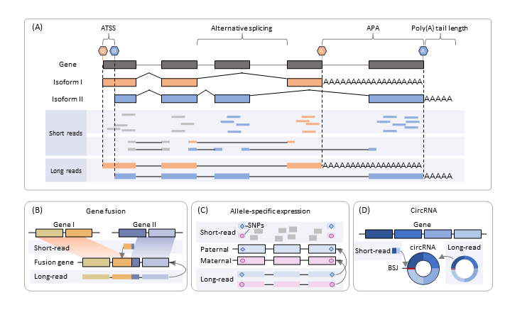

# TRANSCRIPTOME COMPLEXITY: NOVEL INSIGHTS FROM LONG READS

After transcript reconstruction, LRS enables a more direct and comprehensive view of transcriptome complexity. Because single reads preserve long-range exon connectivity and, in DRS, retain native strand information and terminal features, long reads are particularly powerful for resolving alternative splicing, ATSS, APA, poly(A) tail dynamics, circular RNAs, fusion transcripts, and allele-specific expression in a unified isoform-centric framework.

*Figure 7. Advantages of long reads over short reads in resolving complex transcription events. (A) Long reads can identify distinct 5′ and 3′ transcript ends and accurately determine which isoform a read originates from, whereas short reads often have difficulty with precise mapping. Long-read sequencing can also resolve complex alternative splicing events with high confidence, while short reads frequently suffer from ambiguous mapping. In addition, long reads can directly measure the length of the poly(A) tail, whereas short reads typically cannot reliably determine long poly(A) tail lengths. (B) Long reads provide stronger global resolution of full-length circular RNA structures compared with short reads. (C) Long reads can directly capture the full-length structure of fusion transcripts, while short reads usually provide only partial or local information. (D) Long reads can accurately determine whether a full-length transcript originates from the paternal or maternal allele through linking multiple SNPs, whereas short reads can only assign parental origin for the limited subset of reads containing informative SNPs. ATSS: alternative transcription start site; APA: alternative polyadenylation; circRNA, circular RNA; SNP, single nucleotide polymorphism; BSJ: back-splice junction.*

## Alternative splicing

Alternative splicing generates multiple RNA isoforms from a gene and is a major driver of proteomic diversity (Figure 7A) [[5]](../references.md#ref5). Long reads can span multiple exons in a single molecule, allowing exon connectivity and coordinated splicing patterns to be observed directly rather than inferred from fragmented short reads [[267]](../references.md#ref267). DRS preserves native RNA features, making it possible to interpret splicing together with poly(A)-related signals and other regulatory layers (e.g., RNA modifications) on the same molecule [[37]](../references.md#ref37), [[268]](../references.md#ref268), [[269]](../references.md#ref269), [[270]](../references.md#ref270).

Splicing analysis typically follows two complementary routes. Event-level approaches (e.g., rMATS-turbo [[271]](../references.md#ref271), IRFinder-S [[272]](../references.md#ref272), DIGGER [[273]](../references.md#ref273), Exon Ontology [[274]](../references.md#ref274), NEASE [[275]](../references.md#ref275), DoChaP [[276]](../references.md#ref276), MAJIA [[277]](../references.md#ref277), [[278]](../references.md#ref278)) quantify canonical events such as exon skipping, alternative 5′ and 3′ splice sites, intron retention, and mutually exclusive exons, often using PSI-like metrics and replicate-aware statistics; rMATS-turbo [[271]](../references.md#ref271) is widely used for differential splicing at this level, while IRFinder-S [[272]](../references.md#ref272) is tailored for high-precision intron retention quantification. In addition, graph-based frameworks such as MAJIQ [[277]](../references.md#ref277), [[278]](../references.md#ref278) extend this paradigm by modeling local splicing variations (LSVs), enabling the quantification of both classical event types and more complex, non-binary splicing patterns. Isoform-centric approaches (e.g., MISO [[279]](../references.md#ref279), IUTA [[280]](../references.md#ref280), DRIMSeq [[281]](../references.md#ref281), satuRn [[282]](../references.md#ref282), IsoformSwitchAnalyzeR [[283]](../references.md#ref283), tappAS [[284]](../references.md#ref284)) treat full-length transcripts as the primary unit, better capturing combinations of multiple events and their functional consequences; tools such as IsoformSwitchAnalyzeR [[283]](../references.md#ref283) and tappAS [[284]](../references.md#ref284) integrate ORF prediction, domain changes, and nonsense-mediated decay (NMD) sensitivity. In long-read workflows, generating reliable full-length isoform models is the critical first step, commonly using callers such as IsoQuant [[205]](../references.md#ref205), Bambu [[211]](../references.md#ref211), FLAIR [[204]](../references.md#ref204), and StringTie2 [[78]](../references.md#ref78), after which event-level summaries can be added when classical event statistics are needed.

## Alternative transcription start site

ATSS usage increases isoform diversity by producing distinct 5′ ends associated with different promoter choice, first exon usage, and untranslated region sequence. This can in turn reshape RNA stability, translation, coding potential, and regulatory element composition (Figure 7A) [[270]](../references.md#ref270), [[285]](../references.md#ref285), [[286]](../references.md#ref286). Short-read strategies such as CAGE provide strong promoter-level evidence but often cannot connect a specific start site to the full transcript body, making it difficult to determine which splicing patterns and 3′ ends are coupled to a given promoter at alternatively-spliced loci [[287]](../references.md#ref287), [[288]](../references.md#ref288), [[289]](../references.md#ref289), [[290]](../references.md#ref290).

Long reads address this linkage problem by preserving continuity from the 5′ region through internal exon structure to the 3′ end, enabling promoter switching and alternative first-exon usage to be interpreted together. In practice, ATSS analysis is best embedded in transcript reconstruction and boundary refinement workflows using tools such as FLAIR [[204]](../references.md#ref204), StringTie2 [[78]](../references.md#ref78), IsoQuant [[205]](../references.md#ref205), and Bambu [[211]](../references.md#ref211) to collapse reads into transcript models and quantify isoform abundance. Because native RNA datasets can suffer from incomplete 5′ capture and systematic truncation, read-start coordinates alone are often insufficient for *de novo* TSS discovery, so start-site clustering methods such as NAGATA [[291]](../references.md#ref291) and LoRTIA (<https://github.com/zsolt-balazs/LoRTIA>) and refinement strategies that integrate annotations or external 5′-end datasets are commonly used, with cap-associated evidence like CAGE [[287]](../references.md#ref287) and ReCappable-seq [[289]](../references.md#ref289) providing high-confidence validation when precise TSS catalogs are required.

## Alternative cleavage and polyadenylation

APA diversifies the transcriptome by generating distinct 3′ ends, changing 3′ UTR length and cis-regulatory content, influencing localization and stability, and sometimes modifying coding potential through alternative terminal exons or intronic polyadenylation (Figure 7A) [[292]](../references.md#ref292), [[293]](../references.md#ref293), [[294]](../references.md#ref294). Short-read RNA-seq and dedicated 3′-end methods can detect global shifts in poly(A) site usage, but they often struggle to assign a specific cleavage site to a particular full-length isoform or to resolve coupling between APA, upstream splicing, and promoter choice [[295]](../references.md#ref295), [[296]](../references.md#ref296), [[297]](../references.md#ref297).

LRS, especially DRS that begins at the native 3′ end, provides direct evidence for transcript termination sites and links them to full-length isoform structure. APA can be characterized either by clustering read ends to build poly(A) site catalogs and quantify differential usage, as supported by tools such as APALORD [[298]](../references.md#ref298) and LAPA [[299]](../references.md#ref299), or by first reconstructing high-confidence isoforms with long-read transcriptome tools such as FLAIR [[204]](../references.md#ref204), IsoQuant [[205]](../references.md#ref205), StringTie2 [[78]](../references.md#ref78), or Bambu [[211]](../references.md#ref211) and then performing gene-wise 3′-end clustering within each isoform set to study coordinated RNA processing. Given technical artifacts such as internal priming and end-alignment uncertainty, robust analyses typically combine end-site clustering with stringent filtering, replicate support, and conservative interpretation of weakly supported sites, selecting direct end-site discovery when site cataloging is the primary goal and isoform-aware inference when mechanistic coupling across transcript features is the focus.

## Poly(A) tail length

Poly(A) tails are dynamic regulators of mRNA maturation, stability, and translation [[300]](../references.md#ref300), [[301]](../references.md#ref301), with effects that depend on cellular context and tail composition (Figure 7A). Conventional assays such as TAIL-seq [[302]](../references.md#ref302) provide valuable transcriptome-wide measurements but generally separate tail information from the full-length isoform context, limiting the ability to associate tail length with specific isoforms, splicing patterns, cleavage choices, or RNA modification states [[98]](../references.md#ref98).

DRS enables tail-length estimation on the same molecule that carries the transcript sequence by detecting the characteristic poly(A) signal region and converting its duration to nucleotides using read-specific translocation rates [[37]](../references.md#ref37), [[303]](../references.md#ref303), [[304]](../references.md#ref304). Practical workflows often use established callers such as Nanopolish (https://github.com/jts/nanopolish) and tailfindr [[304]](../references.md#ref304), while Dorado (https://github.com/nanoporetech/dorado/) can provide built-in poly(A) or poly(T) estimates directly in BAM outputs for streamlined processing. Because tail-length estimates are sensitive to signal noise, speed variation, degradation, and chemistry, analyses typically emphasize replicate-supported distribution shifts and relative differences across conditions or isoforms rather than relying on absolute nucleotide-level values, integrating tail profiles with reconstructed isoforms and APA patterns to obtain the most informative isoform-resolved view of 3′-end regulation [[88]](../references.md#ref88), [[98]](../references.md#ref98), [[305]](../references.md#ref305), [[306]](../references.md#ref306).

Beyond homopolymeric adenosines, emerging evidence has revealed that poly(A) tails frequently contain non-adenosine residues (i.e., C, G, U) interspersed within the adenosine stretch [[102]](../references.md#ref102), [[307]](../references.md#ref307), [[308]](../references.md#ref308). DRS is uniquely suited to study such composite tails, while detecting non-adenosines within homopolymeric stretches remains challenging due to the uniform electrical signals of consecutive identical bases. To address this, Ninetails, a neural network-based method, was developed to accurately identify and classify individual C, G and U residues within poly(A) tails from DRS data [[309]](../references.md#ref309).

## Circular RNA

Circular RNAs (circRNAs) arise from back-splicing to form covalently closed molecules and often exhibit complex internal splicing that yields multiple circRNA isoforms (Figure 7B) [[310]](../references.md#ref310). Short-read methods largely rely on detecting back-splice junctions, which makes full-length reconstruction difficult when circRNA sequences closely resemble linear transcripts [[311]](../references.md#ref311), [[312]](../references.md#ref312), [[313]](../references.md#ref313). Long reads can span entire circRNA molecules and therefore provide a stronger basis for defining circRNA architecture and isoform diversity [[314]](../references.md#ref314).

Long-read circRNA sequencing typically enriches circRNAs through rRNA depletion, RNase R digestion, and poly(A)-negative selection, followed by library construction using rolling-circle RT or amplification strategies, with protocols such as CIRI-long [[315]](../references.md#ref315), [[316]](../references.md#ref316), circFL-seq [[317]](../references.md#ref317), and isoCirc [[318]](../references.md#ref318) widely used, and circNick-LRS [[319]](../references.md#ref319) offering an alternative via selective cleavage to produce linear templates. Identification generally combines back-splice junction detection with full-length reconstruction, and because sensitivity can vary substantially across tools with limited overlap between call sets, combining callers is often used to improve robustness [[320]](../references.md#ref320). Quantification remains challenging with long reads due to low circRNA fractions and concatemer-related artifacts, so expression estimation is frequently anchored by short-read-based approaches such as CIRIquant [[321]](../references.md#ref321), while long-read experiments benefit from synthetic circRNA spike-ins for normalization and careful consideration of RNase R-associated biases [[322]](../references.md#ref322).

## Fusion gene

Gene fusions are widespread in cancer and can result from read-through transcription, structural rearrangements, TE-mediated events, and rare trans-splicing (Figure 7C) [[323]](../references.md#ref323), [[324]](../references.md#ref324). Long reads improve fusion discovery by capturing breakpoint-spanning molecules and full exon connectivity, enabling more confident fusion partner assignment and better isoform resolution than short-read approaches [[325]](../references.md#ref325).

Bulk fusion detection often begins with splice-aware genome alignment followed by chimeric read identification, as implemented in tools such as LongGF [[326]](../references.md#ref326) and JAFFAL [[325]](../references.md#ref325), with auxiliary annotation support from frameworks like SQANTI3 [[212]](../references.md#ref212). To reduce false positives, clustering and statistical filtering strategies are commonly applied, including Genion [[327]](../references.md#ref327) and FusionSeeker [[328]](../references.md#ref328), while reconstruction-and-realignment approaches such as FUGAREC [[329]](../references.md#ref329), CTAT-LR-fusion [[330]](../references.md#ref330), and FLAIR-fusion [[331]](../references.md#ref331), strengthen breakpoint and splice-structure support and enable isoform-level fusion modeling. For higher robustness, multi-caller integration methods such as GFvoter [[332]](../references.md#ref332) can combine complementary strengths, and for single-cell contexts, tools designed for sparse and heterogeneous data such as GFHunter [[333]](../references.md#ref333) and LongFUSE [[334]](../references.md#ref334) are often preferred, with IFDlong [[335]](../references.md#ref335) providing a route to transcript-level fusion quantification using an EM-like framework after detection.

## Allele-specific expression

ASE and splicing analyses benefit from long reads because single molecules can span multiple heterozygous variants, reducing mapping ambiguity and enabling direct phasing of isoforms onto haplotypes (Figure 7D) [[336]](../references.md#ref336). Compared with short reads, this supports more reliable separation of allele-specific effects on expression level and splice choice, and it helps disentangle cis- and trans- contributions to expression and splicing regulation [[337]](../references.md#ref337).

Effective ASE workflows typically focus on reducing reference-mapping bias and achieving haplotype-aware quantification. Recent advances in long-read RNA-seq have enabled unified frameworks for SNP calling, haplotype phasing, and allele-specific analysis directly from transcriptomic data, as exemplified by longcallR [[336]](../references.md#ref336), which leverages full-length reads to jointly resolve variants, haplotypes, and allele-specific expression. Personalized haplotype references, as used by LORALS [[338]](../references.md#ref338), improve allele assignment and support both allele-specific expression and splicing, while variation-graph-based approaches such as RPVG [[339]](../references.md#ref339) connect pangenome representations with haplotype-specific transcript inference. Event-level strategies such as IsoLASER [[340]](../references.md#ref340) combine local reassembly with haplotype clustering to dissect allele-associated splicing effects within individuals, and isoform-centric pipelines such as FLAIR2 [[341]](../references.md#ref341) extend long-read transcript annotation to haplotype-aware analysis. For studies emphasizing haplotype-resolved isoform reconstruction and parent-of-origin effects, tools such as IDP-ASE [[342]](../references.md#ref342), HapIso [[343]](../references.md#ref343), and IsoPhase [[344]](../references.md#ref344) provide complementary capabilities across diverse organisms and experimental designs.
