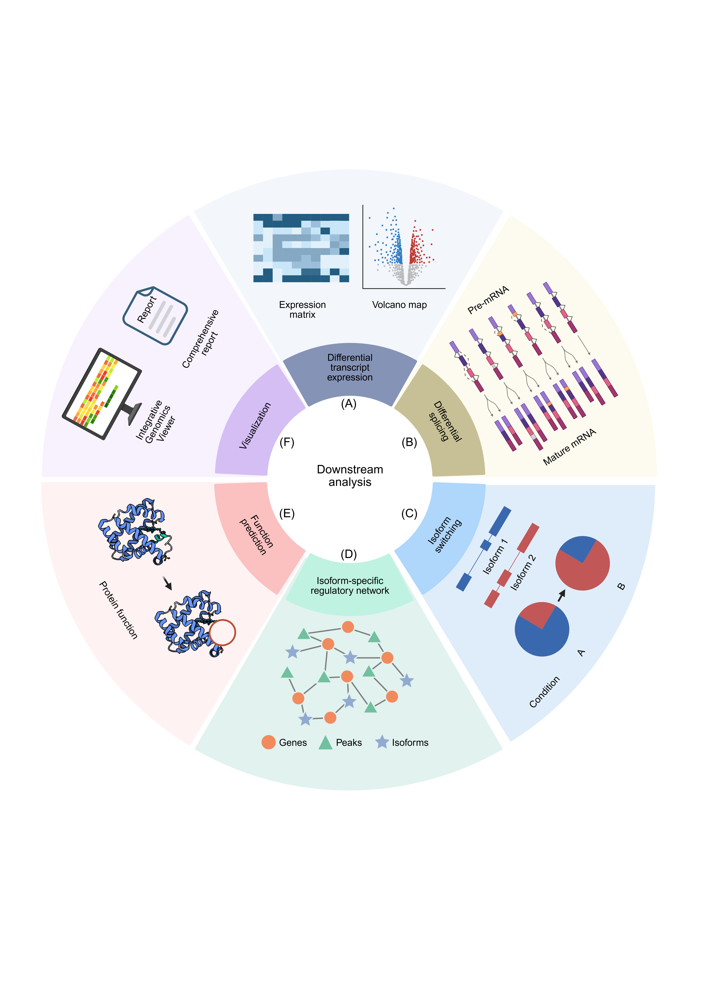

# DOWNSTREAM ANALYSES: FROM TRANSCRIPTS TO BIOLOGICAL INSIGHTS

Long reads shift transcriptomics from fragment-based inference to direct, single-molecule observation of full-length transcripts. Because a single read can capture complete splice connectivity together with transcript boundaries (TSS/TES) and poly(A) site choice, it can enable more confident isoform definition and reduces short-read attribution errors caused by shared exons, incomplete annotations, and disconnected end-splicing information [[18]](../references.md#ref18). Long reads can link multiple heterozygous variants to support allele/haplotype phasing and span fusion breakpoints to resolve chimeric transcript structures [[354]](../references.md#ref354). Together, these strengths are driving downstream analysis beyond traditional gene-level differential expression toward a transcript-centric framework that integrates structure, quantification, function, and regulation, covering differential transcript expression, differential splicing, isoform switching, isoform-level regulatory network inference, function prediction and visualization (Figure 8).

*Figure 8. Downstream analyses for transcriptomics studies enabled by LRS. (A) Differential transcript expression analysis generates an expression matrix and identifies significantly changed isoforms between conditions. (B) Differential splicing analysis detects condition-associated alternative splicing events with a full-length picture. (C) Isoform switching analysis quantifies changes in the relative usage of isoforms from the same gene across conditions. (D) Isoform-specific regulatory network inference links transcript isoforms to upstream regulators and downstream targets to reveal isoform-level regulatory programs. (E) Functional prediction annotates isoforms and evaluates potential impacts on protein domains and biological functions. (F) Visualization and reporting integrate results through genome browsers and comprehensive reports to facilitate interpretation and dissemination.*

## Differential transcript expression

Differential transcript expression (DTE) tests whether the absolute abundance of specific transcript isoforms differs across conditions and is the primary goal of isoform-resolved quantification (Figure 8A). Because isoforms can vary in coding sequence and regulatory features, isoform-level changes can drive phenotypic diversity, cell-state transitions, and development [[355]](../references.md#ref355), [[356]](../references.md#ref356). Clinically, pathogenic isoform reproportioning may occur without a change in total gene expression; for example, cancer progression and drug resistance have be associated with the overexpression of specific oncogenic isoforms, making DTE valuable for biomarker discovery and therapeutic targeting [[357]](../references.md#ref357).

Methodologically, DTE workflows can be grouped by the data used for isoform quantification. For short-read RNA-seq, isoform abundance is typically inferred by probabilistic assignment of fragments to transcripts, using tools such as Salmon [[236]](../references.md#ref236), kallisto [[234]](../references.md#ref234), and RSEM [[235]](../references.md#ref235), often followed by uncertainty-aware DTE testing with sleuth [[358]](../references.md#ref358) or count-based testing after transcript-level summarization with tximport and models such as DESeq2 [[359]](../references.md#ref359), edgeR [[360]](../references.md#ref360), or limma-voom [[361]](../references.md#ref361). This strategy benefits from the high sequencing depth usually affordable by short reads and mature statistical models, but it is vulnerable to read misassignment when isoforms share exons, transcript ends are heterogeneous, or annotations are incomplete, which can bias abundance estimates and inflate false positives, particularly for complex loci. For long-read RNA-seq, isoforms can be directly observed and quantified with IsoQuant [[216]](../references.md#ref216), FLAIR [[214]](../references.md#ref214), Bambu [[222]](../references.md#ref222), StringTie3 (long-read mode) [[215]](../references.md#ref215), miniQuant [[238]](../references.md#ref238), and then tested using the same differential-expression backends (DESeq2 [[359]](../references.md#ref359), edgeR [[362]](../references.md#ref362), limma-voom [[361]](../references.md#ref361)) or long-read-oriented integrated frameworks such as IsoTools 2.0 [[217]](../references.md#ref217). Long reads reduce ambiguity in isoform definition and improve TSS/TES completeness, but long-read-only DTE can be constrained by lower effective sequencing depth and platform- or protocol-specific biases, increasing the importance of normalization, replicate number, and filtering. A third, increasingly adopted category is hybrid analysis: long reads are used to build or curate a high-confidence, study-specific transcript reference, while high-depth short reads provide precise quantification against that reference (e.g., Salmon [[236]](../references.md#ref236), kallisto [[234]](../references.md#ref234) or RSEM [[235]](../references.md#ref235) with tximport, then DESeq2 [[359]](../references.md#ref359), edgeR [[360]](../references.md#ref360) or limma-voom [[361]](../references.md#ref361)), combining structural accuracy with statistical power; its main limitation is the added complexity of reference harmonization and cross-platform bias control.

For long-read transcriptomics, a practical recommendation is to use long reads to construct or refine a sample-relevant isoform annotation, quantify at the transcript level against this fixed reference, and apply established differential-expression models matched to the experimental design. DESeq2 [[359]](../references.md#ref359) and edgeR [[362]](../references.md#ref362) are robust defaults for count-based testing, especially with small to moderate sample sizes, while limma-voom is advantageous for multi-factor designs with covariates and interactions; for abundance estimates where quantification uncertainty should be carried through, sleuth [[358]](../references.md#ref358) is a suitable option, and linear mixed models are preferred for repeated-measures or hierarchical designs. In long-read-dominant studies that benefit from a single structure-aware workflow, IsoTools 2.0 [[217]](../references.md#ref217) can integrate isoform discovery, quantification, and differential analyses. In all cases, long-read DTE should explicitly address library type, read-length distribution, 3′ bias, PCR duplicates, platform-specific error profiles, and isoform effective-length comparability, and results should be reported with log2 fold changes and confidence intervals, multiple-testing adjustment, and consistency checks between gene- and isoform-level signals. Key findings are best supported by orthogonal validation such as isoform-specific qPCR, targeted LRS, and proteomics or Ribo-seq when coding changes are implicated.

## Differential splicing

Differential splicing (DS) tests whether the configuration of RNA splicing changes between conditions at a local, event-like level, capturing patterns such as exon skipping, mutually exclusive exons, alternative splice-site choice, and intron retention (Figure 8B). Unlike analyses that focus only on changes in whole-isoform abundance, DS is tightly linked to cis-regulatory elements and trans-acting regulators, including splicing factors and RNA-binding proteins, which makes it particularly useful for mechanistic interpretation and regulator prioritization [[363]](../references.md#ref363). Because alternative splicing expands proteomic and regulatory diversity, aberrant DS is a common feature of genetic disorders and cancer, where disruptions in the splicing machinery can lead to widespread mis-splicing [[364]](../references.md#ref364). Additionally, recent studies have linked splicing dysregulation to aging and age-associated decline, where disruptions in RNA-binding proteins and spliceosomal components lead to widespread mis-splicing [[365]](../references.md#ref365), [[366]](../references.md#ref366), [[367]](../references.md#ref367), [[368]](../references.md#ref368).

Current DS methods can be organized by the data type and the way splicing is represented and quantified. Short-read RNA-seq remains widely used and typically relies on junction and exon-intron evidence, but it cannot reliably phase distant events into full transcript configurations and is sensitive to annotation incompleteness and structural ambiguity, which can reduce power for complex or non-canonical events [[369]](../references.md#ref369), [[370]](../references.md#ref370). Within short-read-driven approaches, event-template methods such as rMATS [[371]](../references.md#ref371) provide standardized outputs for common event classes and are straightforward to interpret, but they are less flexible for multi-branch or complex splicing. Graph/probabilistic local-variation models such as MAJIQ [[287]](../references.md#ref287), [[288]](../references.md#ref288) are well suited to multi-branch splicing and quantify uncertainty, at the cost of more complex modeling and interpretation. Isoform-abundance-derived event methods such as SUPPA2 [[372]](../references.md#ref372) compute PSI from transcript quantification, making them convenient when reliable isoform estimation and annotations exist, but they inherit biases from transcript inference and annotation quality. Annotation-light intron-clustering methods such as LeafCutter [[373]](../references.md#ref373) reduce reliance on transcript models and can discover novel differential intron usage, although mapping clusters back to canonical event labels or biological interpretation can be less direct. Count-based exon/junction frameworks such as DEXSeq [[374]](../references.md#ref374) and JunctionSeq [[375]](../references.md#ref375) provide robust generalized linear-model testing and serve as strong baselines, but their features do not always correspond cleanly to discrete splicing events and can be harder to translate into specific splice patterns.

In practice, a recommendation is to use long reads to establish high-confidence isoform models and event boundaries, then choose a quantification and testing strategy that matches the study's depth and design. When read depth is limited, a common and effective hybrid approach is to define the event space with long reads and quantify events with higher-coverage data (often short reads) to obtain stable PSI and ΔPSI estimates with controlled FDR; tools such as rMATS [[371]](../references.md#ref371) (and long-read-adapted variants like rMATS-long(https://github.com/Xinglab/rMATS-long)), MAJIQ [[287]](../references.md#ref287), [[288]](../references.md#ref288), LeafCutter [[373]](../references.md#ref373), DEXSeq [[374]](../references.md#ref374) or JunctionSeq [[375]](../references.md#ref375) can then be applied using the LRS-informed annotation or intron sets to reduce systematic biases. When long-read coverage is sufficient and an integrated, structure-aware workflow is preferred, long-read-centric suites such as IsoTools 2.0 [[217]](../references.md#ref217) can perform event-level DS and related isoform-usage analyses within a single framework, improving consistency between discovery, quantification, and reporting.

## Isoform switching

Isoform switching refers to a condition-dependent change in the dominant isoform of a gene, or a reversal in usage between a key isoform pair (Figure 8C). It is useful because switching often implies functional change: it can alter coding-sequence completeness, reading frame, and the proportion of nonsense-mediated decay candidates, reshape domains, signal peptides, and transmembrane segments, and rewire 5′/3′ UTR features such as RBP/miRNA sites, uORFs, and poly(A) signals [[376]](../references.md#ref376). In biomedical settings, isoform switching analysis helps prioritize mechanistically interpretable candidates and can support clinically oriented questions such as identifying recurrent, potentially targetable isoform-derived neoantigens across tumors [[377]](../references.md#ref377).

Methodologically, isoform switching can be inferred from short-read quantification, long-read isoform-resolved measurements, or hybrid designs, and it is important to distinguish a statistically significant switch from a switch with credible functional consequences. Short-read workflows typically quantify transcripts with Salmon [[236]](../references.md#ref236), kallisto [[234]](../references.md#ref234), and RSEM [[235]](../references.md#ref235) and then test differential transcript usage, ranking candidates by effect size (for example, changes in isoform usage fraction) [[293]](../references.md#ref293), [[378]](../references.md#ref378). They are cost-effective and powerful with sufficient depth, but are vulnerable to incomplete annotations and ambiguous read assignment among similar isoforms, especially near transcript ends, which weakens ORF/NMD inference and can generate artifactual switches. Long reads directly capture full-length structures and reduce end ambiguity, improving confidence in ORF and consequence predictions, but quantification can be limited by lower depth and platform- or protocol-specific biases. For consequence-focused interpretation, IsoformSwitchAnalyzeR [[293]](../references.md#ref293) provides an integrated workflow for switch calling, consequence annotation (including ORF/NMD), and enrichment analysis, with optional links to Pfam [[379]](../references.md#ref379), InterPro [[380]](../references.md#ref380), SignalP [[381]](../references.md#ref381), and TMHMM [[382]](../references.md#ref382); tappAS [[294]](../references.md#ref294) emphasizes functional-feature usage with visualization and statistics; and Biosurfer [[383]](../references.md#ref383) helps track transcript-to-protein differences to better triage candidates, typically as a complement to formal testing.

Building on these considerations, long-read transcriptomics is best used to create a high-confidence, sample-specific isoform catalog with accurate transcript ends, after which isoform usage should be quantified using a strategy matched to coverage and design. When long-read depth is modest, a practical hybrid approach is to use long reads for discovery and validation, quantify isoform usage with deep short reads against the curated reference, and call switching based on both statistical significance and effect size. With sufficient long-read coverage, long-read quantification can be used directly, provided normalization, duplicate handling, and platform bias are carefully controlled.

## Isoform-specific regulatory network

Isoform-specific regulatory networks move beyond gene-level graphs by treating transcript isoforms as separate nodes with distinct structures and regulatory elements (Figure 8D). This is important because splicing can alter protein interaction surfaces and localization signals, while alternative 5′/3′ UTRs can change miRNA and RBP binding landscapes, producing different or even opposite outcomes from the same gene locus [[384]](../references.md#ref384). Short-read gene-level networks often mask these effects by averaging isoform signals and by poorly linking UTR features to the matching coding sequence, limiting mechanistic interpretation of post-transcriptional regulation. LRS helps by resolving full-length isoforms and assigning exons, UTRs, and poly(A) sites to specific transcripts, providing a clearer substrate for network inference [[216]](../references.md#ref216), [[244]](../references.md#ref244), [[346]](../references.md#ref346).

Methods mainly differ in how they define edges and what evidence supports them. Co-expression/co-variation approaches infer edges from correlated isoform abundance; WGCNA [[385]](../references.md#ref385) builds interpretable modules and hubs, and MEGENA [[386]](../references.md#ref386) can capture nested, multiscale modules when the feature set is large. They are straightforward but sensitive to confounding and dimensionality, require stability checks, and correlation does not imply direction. Sequence- and element-driven approaches predict miRNA/RBP regulation from isoform-resolved UTRs, using tools such as TargetScan (miRNAs) [[387]](../references.md#ref387) and RBPmap (RBPs) [[388]](../references.md#ref388); they scale well and are mechanistically motivated, but can be noisy and typically need empirical binding support from eCLIP [[389]](../references.md#ref389) (with peak callers such as PureCLIP [[390]](../references.md#ref390)) and functional readouts such as Ribo-seq, proteomics, or perturbations. Multi-omics integration anchors isoform-level regulation with orthogonal signals, especially cis QTLs (sQTLs, apaQTLs) together with chromatin or promoter activity; QTLtools [[391]](../references.md#ref391) is commonly used for mapping and coloc [[392]](../references.md#ref392) for colocalization. Curated resources such as RegNetwork 2025 [[393]](../references.md#ref393) are best used for benchmarking and annotation, while keeping predicted edges separate from evidence-supported ones.

For long-read transcriptomics, a practical workflow is to first build a high-confidence, sample-matched isoform catalog with accurate UTR and poly(A) annotations, then infer networks in layers that separate prediction from support. Use long reads to define isoform nodes and regulatory elements, and use deeper short reads (or sufficiently deep long reads) to stabilize isoform quantification for co-variation analyses, with robustness assessed across resampling, batches, and cohorts. Compute miRNA/RBP edges on isoform-specific UTRs and filter or weight them using eCLIP [[389]](../references.md#ref389) and downstream functional evidence, reserving perturbation experiments for key hubs and modules. When genotype data are available, add sQTL/apaQTL and colocalization to prioritize cis-linked edges and reduce gene-level masking. In reporting, clearly distinguish correlation modules, sequence-based predictions, and edges supported by binding or genetic evidence, emphasizing results that replicate across datasets and evidence types.

## Function prediction

Function prediction in isoform-resolved transcriptomics assigns each transcript variant plausible molecular consequences and testable mechanisms, linking isoform changes to protein output, localization, stability, and regulatory sensitivity (Figure 8E). It aims to explain how a specific isoform alters function, for example through domain gain or loss, changes in interaction interfaces, signal peptides or transmembrane segments, UTR rewiring that affects translation, or increased NMD that reduces protein levels [[384]](../references.md#ref384), [[394]](../references.md#ref394), [[395]](../references.md#ref395). This step connects differential isoform signals to concrete hypotheses and helps prioritize candidates for validation.

Methods vary by input data and evidentiary strength. Transcript-sequence-based consequence annotation infers coding potential, ORFs, frame preservation, premature termination, NMD propensity, and protein features such as domains, signal peptides, and transmembrane regions; IsoformSwitchAnalyzeR [[293]](../references.md#ref293) and tappAS [[294]](../references.md#ref294) are widely used to run these annotations at scale and relate them to isoform switching or differential usage. These approaches are fast and interpretable, but they depend on accurate isoform models and transcript ends; fragmented or misassembled short-read reconstructions can yield chimeras and false ORFs, producing misleading feature calls. Proteoform-focused tools such as Biosurfer [[383]](../references.md#ref383) compare predicted impacts across transcript, codon, and protein representations and help attribute changes to alternative TSS, splicing, or termination, but their conclusions remain predictive without protein-level support. Structure-oriented analyses add a mechanistic check on whether splicing changes likely disrupt folded regions or interaction interfaces, yet they are typically best suited as a targeted layer for high-priority events and can be limited by structural coverage and context.

With long-read transcriptomics, full-length isoform resolution should be the starting point, followed by staged, evidence-aware interpretation. Build a high-confidence, sample-matched isoform set with accurate ends and sufficient expression support, then annotate ORFs and consequence classes (frame disruption, truncation, NMD likelihood) together with protein and UTR features using IsoformSwitchAnalyzeR [[293]](../references.md#ref293) or tappAS [[294]](../references.md#ref294), adding Biosurfer [[383]](../references.md#ref383) when proteoform differences are central. When making protein-level claims, prioritize candidates supported by Ribo-seq and/or proteomics, and use structure-oriented analyses selectively to vet the plausibility of disrupted folds or interfaces before committing to targeted functional experiments.

## Visualization

Long-read transcriptome visualization should make full-length isoform differences both easy to interpret and easy to verify, because many biologically important changes are subtle (junction shifts), end-driven (alternative 5′/3′ ends and poly(A) sites), or combinatorial, and are therefore missed by gene-level plots (Figure 8F). The most useful views show complete isoform paths with relative or differential usage, splice junctions and exon connectivity with explicit read support, end and poly(A) heterogeneity, and locus-level QC signals such as coverage dropouts, mapping artifacts, and agreement with matched short-read RNA-seq. When relevant, overlay functional annotations (ORFs, protein domains, NMD-related features) so structural changes directly translate into testable hypotheses. A clear workflow is to present results in layers: gene-level summary first, isoform models and usage next, and event/read-support tracks last, while stating filtering thresholds to avoid over-interpreting low-confidence isoforms.

Tool choice naturally follows this layered goal. IGV [[396]](../references.md#ref396) is indispensable for locus inspection and QC because it can display long-read alignments, junction tracks, coverage, and short-read support side by side, making it the most reliable option for validating candidates and diagnosing artifacts. For communicating isoform structure beyond raw alignments, Swan [[397]](../references.md#ref397) provides graph-based views that highlight isoform paths and end variability and generates compact gene-level reports. If interactive exploration and annotation are needed, IsoVis [[398]](../references.md#ref398) offers a web-based isoform viewer and can map protein features onto exons to connect structure with predicted functional impact. For standardized, end-to-end reporting that links differential analysis outputs directly to figures, isoespy [[399]](../references.md#ref399) is a practical choice. In routine use, combine IGV [[396]](../references.md#ref396) for evidence checking with Swan [[397]](../references.md#ref397) or IsoVis [[398]](../references.md#ref398) for presentation, and add isoespy [[399]](../references.md#ref399) when you need reproducible, pipeline-aligned figure generation.
