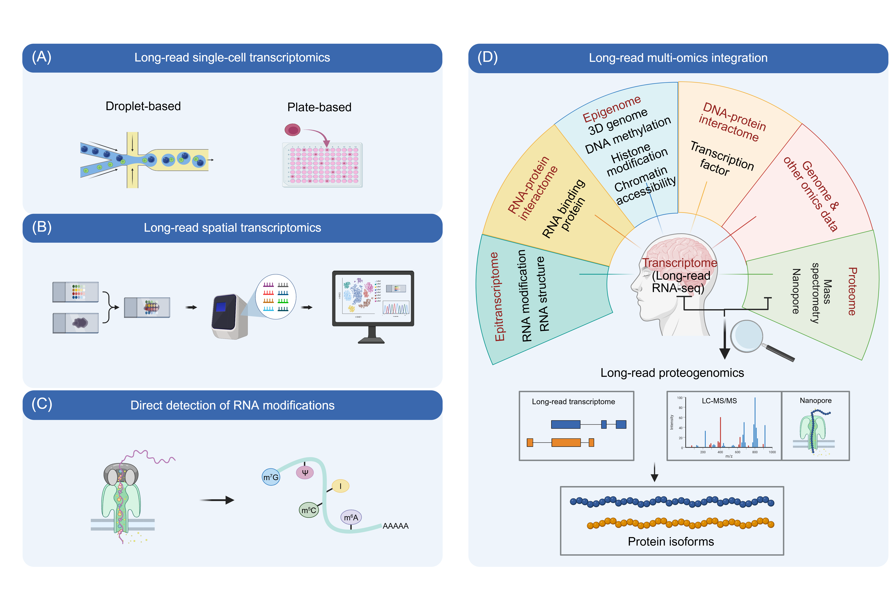

# CHALLENGES AND FRONTIERS

**Challenges: accuracy, throughput and cost**

The long-read advantage of LRS enables characterization of transcript structures using full-length molecular evidence rather than fragment-based inference [[364]](../references.md#ref364). This improves the delineation of novel transcripts, splicing connectivity, transcript boundaries, fusion transcripts and allele-specific information [[285]](../references.md#ref285). However, scalable deployment in large cohorts and routine analysis workflows remains constrained by coupled bottlenecks. Low accuracy compromises base-resolution fidelity in transcript structure characterization [[17]](../references.md#ref17), [[70]](../references.md#ref70); low throughput limits detection of low-abundance and rare transcription events; high cost restricts accessibility for single research groups and limits cohort size; and the lack of standardized analysis pipelines undermines result interpretability and cross-batch comparability [[365]](../references.md#ref365).

**Accuracy: base-level errors and transcript-structure fidelity**

LRS accuracy can be assessed across multiple linked layers: base-level correctness, splice junction fidelity, exon-chain reconstruction with well-defined transcript boundaries, and consistent quantification across conditions. Together, these factors determine the stability of the inferred isoform repertoire and the robustness of downstream differential analyses [[69]](../references.md#ref69), [[200]](../references.md#ref200).

Among current LRS platforms, PacBio HiFi sequencing has established itself as the gold standard for accuracy. HiFi reads routinely achieve >99.9% consensus accuracy, delivering high per-read correctness and structural concordance that support high-confidence end-to-end transcriptome construction [[15]](../references.md#ref15), [[19]](../references.md#ref19). In contrast, ONT and other emerging LRS platforms exhibit more variable error profiles that can compromise analytical precision. ONT error profiles are more context-dependent, with prominent homopolymeric regions [[112]](../references.md#ref112). While ONT DRS retains native RNA characteristics, it is more susceptible to impacts from RNA stability and secondary structure, increasing ambiguity in transcript boundary assignment [[28]](../references.md#ref28), [[74]](../references.md#ref74), [[366]](../references.md#ref366). Beyond ONT, other emerging LRS platforms lack sufficient third-party validation, and their accuracy profiles remain to be systematically evaluated against established benchmarks.

Accuracy is further shaped by library construction methods [[367]](../references.md#ref367). RT template switching and PCR amplification can introduce chimeras and artifactual transcripts that propagate into transcriptome reconstruction as spurious transcript models [[50]](../references.md#ref50), [[368]](../references.md#ref368). Library designs that better constrain true transcript ends such as Cap-trapping or poly(A) tail-focused enrichment strategies can improve full-length structure fidelity [[77]](../references.md#ref77), [[81]](../references.md#ref81), [[82]](../references.md#ref82), [[84]](../references.md#ref84), [[85]](../references.md#ref85), [[88]](../references.md#ref88), [[89]](../references.md#ref89). For ONT cDNA sequencing, approaches such as R2C2 can improve per-read correctness by consensus construction, at the cost of effective depth and throughput [[114]](../references.md#ref114).

Computational methods also play a critical role in accuracy improvement. Advances in basecalling algorithms have progressively reduced error rates for ONT platforms [[13]](../references.md#ref13). Basecaller updates can shift error modes and, in DRS, alter modification-associated signals [[41]](../references.md#ref41), [[112]](../references.md#ref112), [[369]](../references.md#ref369). Downstream computational steps, including alignment filtering, splice junction correction, end processing, and transcript collapsing rules, directly influence structural fidelity of full-length transcripts. Key thresholds should therefore be aligned with study aims and made explicit to support cross-study comparison [[200]](../references.md#ref200), [[370]](../references.md#ref370). In addition, read allocation among highly similar transcripts and repeat-adjacent loci remains intrinsically ambiguous; explicit assignment rules and uncertainty handling are essential for accurate quantification [[69]](../references.md#ref69).

Looking forward, several avenues hold promise for further accuracy improvements. Continued refinement of nanopore chemistries and motor proteins may reduce raw error rates while preserving or increasing translocation speeds. Enhanced basecalling models trained on diverse RNA modification contexts could improve both sequence accuracy and epitranscriptomic signal resolution. The development of standardized reference materials and benchmarking frameworks would also benefit accuracy improvement.

**Throughput: usable molecular evidence rather than nominal yield**

Compared to NGS platforms such as Illumina NovaSeq, which routinely generate hundreds of Gb to a few terabases per run, some LRS platforms (e.g., PacBio Sequel II) face inherent throughput constraints that limit their scalability for large-cohort studies. Given the relatively lower accuracy of LRS, throughput is better assessed by the amount of usable evidence than by nominal Gb yield alone. This is particularly critical for transcriptomics studies, where usable evidence depends on read quality, full-length coverage, end completeness (especially at the 5′ end), and effective per-sample depth after demultiplexing. These constraints are amplified by the wide dynamic range of gene expression: highly abundant transcripts dominate sequencing capacity, whereas low-abundance transcripts and rare splicing events require substantially more supporting molecules for reliable recovery [[2]](../references.md#ref2).

Among LRS platforms, throughput characteristics vary considerably. PacBio platforms, while offering exceptional accuracy, are limited by the number of ZMWs per SMRT Cell. Each ZMW sequences only one molecule per run [[69]](../references.md#ref69). In traditional Iso-Seq workflows, cDNA templates are substantially shorter than the polymerase's maximum synthesis capacity, leading to inefficient capacity utilization. The output of PacBio is shaped by library size distribution, loading efficiency, and the trade-off between insert length and the number of passes per cDNA molecule [[31]](../references.md#ref31).

ONT PromethION platform offers higher theoretical throughput, but output is primarily set by platform parallelization and run configuration. In ONT workflows, usable output depends on the fraction of active pores, chemistries, basecalling models, and template properties. Within the same ONT platform, DRS typically yields fewer reads and more pronounced 5′ end coverage loss compared to cDNA sequencing [[74]](../references.md#ref74), [[285]](../references.md#ref285), [[371]](../references.md#ref371), [[372]](../references.md#ref372).

For emerging LRS platforms (e.g., those from QitanTech, CycloneSEQ), throughput claims (e.g., >100 Gb per run) remain to be independently validated. While these companies report impressive specifications, third-party benchmarking studies are essential to assess whether real-world performance aligns with advertised figures, particularly regarding read accuracy and length distributions, consistency across runs, and end-to-end coverage uniformity.

Several strategies have been developed to mitigate throughput constraints. Chemistry upgrades can increase reads per run across platforms. In PacBio, template-organization strategies (e.g., Kinnex) can increase the information carried per read when typical transcript lengths are shorter than the platform's readable range [[120]](../references.md#ref120). When analyses target predefined genes or event classes, effective throughput can be increased by preferentially allocating sequencing capacity to molecules of interest. During library construction, targeted capture like TEQUILA-seq increases the on-target fraction under a fixed read budget [[77]](../references.md#ref77). At the stage of sequencing, adaptive sampling, implemented by ONT platforms, redistributes sequencing capacity in real time toward specified targets [[373]](../references.md#ref373), [[374]](../references.md#ref374).

Looking forward, further innovations in throughput enhancement are needed. For PacBio, increasing ZMW density and improving polymerase processivity could yield higher read counts per SMRT Cell. For ONT and other nanopore-based platforms, developing more stable flow cell manufacturing processes would reduce inter-run variability and improve throughput predictability. Continued advances in motor protein speed and processivity could increase translocation rates without compromising accuracy. Effective throughput is determined not only by platform specifications but also by library construction strategies, capacity allocation, and the alignment between study design and available evidence density. Ongoing innovations in template organization, targeted enrichment and reusable nanopore architectures hold promise for the future.

**Cost: declining but still a barrier for individual laboratories**

Among the constraints facing LRS adoption, cost most directly limits cohort scale and routine adoption. For LRS, cost is better conceptualized as the total end-to-end investment required to produce qualified, usable data across the entire workflow, rather than the nominal price per run or per Gb [[75]](../references.md#ref75). This distinction matters because overall expenditure is typically dominated by cumulative attrition across multiple steps and by coverage requirements imposed by downstream tasks, rather than by any single reagent line item [[375]](../references.md#ref375).

Hardware and consumables at the sequencing end constitute the most direct cost sources. The initial capital investment, maintenance, and auxiliary infrastructure required for mainstream LRS platforms elevate long-term operational expenses, while single-use core consumables (e.g., flow cells for ONT) represent substantial recurring expenditures [[376]](../references.md#ref376). Despite continuous technological iterations, LRS generally remains more expensive than NGS per unit of data. Estimated costs per Gb for CLR mode and HiFi mode generated by the PacBio Sequel II platform are approximately $13–$26 and $43–$86 respectively, whereas the ONT PromethION costs about $21–$42 [[131]](../references.md#ref131), all of which exceed those of NGS platforms (<$10 per Gb) [[377]](../references.md#ref377). Notably, these figures may not reflect current pricing, as platform upgrades (e.g., PacBio Revio/Vega) and market dynamics have likely shifted costs downward. For emerging LRS platforms (e.g., QitanTech, CycloneSEQ), pricing remains largely opaque. While these companies may offer competitive per-run or per-Gb pricing, the lack of publicly available information and limited third-party validation make it difficult to assess their true cost-effectiveness. Additionally, direct comparisons based solely on per-Gb metrics can be misleading because the value of LRS lies not in raw data volume but in the unique information provided by high-accuracy full-length reads.

Upfront sample preprocessing and library preparation are frequently underestimated contributors to total LRS cost. LRS-based transcriptome characterization depends on high-integrity RNA molecules. In degradation-prone specimens such as FFPE tissues, standard automation often fails to yield qualified input, forcing more labor-intensive extraction and QC workflows [[378]](../references.md#ref378), [[379]](../references.md#ref379). Library preparation is also technically demanding, and degraded samples can incur high failure and repeat rates. Moreover, many applications (e.g., differential transcript expression) require sufficient molecule counts and replicates to separate true signals from technical noise, further increasing total investment.

Several practical strategies can reduce end-to-end costs. The first level is increasing usable yield per run, which amortizes fixed consumable costs across more data. Chemistry and workflow improvements, together with multiplexing, enable more efficient use of flow cells and reagents across samples [[108]](../references.md#ref108), [[111]](../references.md#ref111). Higher-throughput platforms such as PacBio Revio and ONT PromethION substantially reduce per-sample costs when fully utilized. Since LRS operation is currently not fully robust, reducing failure and repeat rates through optimized protocols, automation and standardized experimental workflows represents another direction for cost reduction. At the study-design level, targeted enrichment or selective sequencing can further reduce the cost per actionable evidence by concentrating reads on question-relevant molecules [[77]](../references.md#ref77). Additionally, hybrid study designs that use long reads for transcript discovery and short reads for transcript quantification can substantially reduce the long-read depth required to meet analytical objectives, thereby minimizing the consumption of high-cost LRS resources and lowering the overall end-to-end cost [[209]](../references.md#ref209), [[380]](../references.md#ref380).

The cost trajectory for LRS is expected to continue downward as platform technologies mature. However, for individual laboratories, cost remains a substantial barrier. Although ONT offers portable, low-entry-barrier devices such as the MinION, the per-sample or per-Gb cost for small-scale users is considerably higher than for large institutions that can fully utilize high-throughput platforms like PromethION or Revio. This pricing structure creates a disparity where smaller research groups face disproportionately high per-unit costs, limiting equitable access to LRS technologies. The economic viability of LRS therefore hinges on whether its higher sequencing costs are compensated by the added value of long reads. By providing end-to-end transcript structures, LRS can reduce ambiguity and false positives, thereby lowering the need for extensive downstream computation and follow-up experiments.

## Challenges: standardization of bioinformatics methods

LRS technology has fundamentally reshaped the dimensions of exploring transcriptomic complexity, including alternative isoform regulation [[317]](../references.md#ref317), ranging from single-cell isoform resolution [[61]](../references.md#ref61), [[381]](../references.md#ref381), and spatial transcriptomics [[117]](../references.md#ref117), [[382]](../references.md#ref382) to direct RNA modification detection [[18]](../references.md#ref18), [[285]](../references.md#ref285) and proteogenomic integration [[383]](../references.md#ref383), [[384]](../references.md#ref384). However, the rapid emergence of specialized methods and computational tools has also introduced a major field-wide limitation: standardized workflows and benchmarking frameworks are still lacking for most steps of LRS experimentation and analysis. This "toolbox explosion," while reflecting strong innovation, is increasingly a bottleneck for methodological maturation and clinical translation.

Although various methods share the common goal of resolving full-length transcript isoforms and their regulatory characteristics, LRS workflows exhibit significant heterogeneity at almost every step. At the library construction level, protocol differences between platforms such as ONT and PacBio are pronounced [[385]](../references.md#ref385). Even within the same platform, specific construction strategies are required for different RNA biotypes (e.g., tRNA [[386]](../references.md#ref386), circRNA [[387]](../references.md#ref387), and various non-coding RNAs (ncRNAs) [[388]](../references.md#ref388)). These methodological differences introduce protocol-specific biases, complicating cross-study comparisons and meta-analyses [[389]](../references.md#ref389).

Heterogeneity is even more pronounced at the computational level. For transcript identification and quantification alone, numerous tools (e.g., IsoQuant [[186]](../references.md#ref186), Bambu [[192]](../references.md#ref192), StringTie2 [[62]](../references.md#ref62), FLAIR [[185]](../references.md#ref185), Isosceles [[188]](../references.md#ref188), and miniQuant [[208]](../references.md#ref208)) implement different approaches to read alignment, splice-junction inference, and abundance estimation. Benchmarking studies show significant differences in sensitivity, precision, and false positive rates among these tools, particularly for complex genes and low-abundance isoforms [[69]](../references.md#ref69), [[390]](../references.md#ref390), [[391]](../references.md#ref391). Similarly, in the field of RNA modification detection based on nanopore DRS data, a large number of methods based on statistics, machine learning, or integrated into basecalling pipelines have emerged such as Nanocompore [[392]](../references.md#ref392), xPore [[393]](../references.md#ref393), TandemMod [[394]](../references.md#ref394), CHEUI [[395]](../references.md#ref395), and Dorado's modification detection models, which rely on different assumptions, training data, and signal processing strategies, often leading to discrepant results [396-398]. This fragmentation also exists in poly(A) tail length estimation: tools such as tailfindr [[286]](../references.md#ref286), and Dorado employ different signal segmentation and normalization methods, resulting in variations in tail length distributions. For alternative polyadenylation analysis, methods are also diverse, ranging from isoform inference-based approaches [[186]](../references.md#ref186), [[192]](../references.md#ref192) to dedicated peak identification pipelines such as APALORD [[280]](../references.md#ref280) and LAPA [[281]](../references.md#ref281), with no current consensus on how to optimally identify and quantify poly(A) site usage.

While the current "tool explosion" has driven technological innovation, it has also introduced several key obstacles. First, irreproducibility becomes a prominent issue: choices of different tools and parameters can lead to conflicting biological conclusions, severely undermining the reliability of discoveries based on LRS [[396]](../references.md#ref396), [[398]](../references.md#ref398). Second, the difficulty of method selection is increasingly apparent: the lack of standardized benchmarks presents a significant challenge for researchers, especially newcomers to the field, in selecting appropriate tools for specific biological questions [[69]](../references.md#ref69), [[201]](../references.md#ref201). Third, hindering clinical translation is a realistic bottleneck: if LRS is to realize its potential in precision medicine [[75]](../references.md#ref75), [[399]](../references.md#ref399), regulatory agencies and clinical laboratories require validated, standardized workflows with clear performance metrics. Finally, missed integration opportunities are regrettable: fragmentation between analytical layers (isoform identification, modification detection, poly(A) analysis) prevents us from fully leveraging the potential of LRS data. For example, integrating information on isoforms, modifications, and poly(A) tails could reveal more complex gene regulatory mechanisms [[400]](../references.md#ref400), [[401]](../references.md#ref401).

Addressing these challenges requires a coordinated community effort to establish a multi-dimensional algorithm standardization framework. First, build benchmark datasets and ground truth resources. Comprehensive reference datasets with known ground truth are the cornerstone of algorithm standardization. Consortium like LRGASP have made significant progress in benchmarking isoform identification and quantification methods across platforms and different analysis pipelines [[69]](../references.md#ref69). Future expansion is needed, including synthetic spike-in controls (with defined isoform structures, modification statuses, and poly(A) tail lengths) [402-404], simulation-based benchmarks (allowing systematic evaluation under controlled conditions) [405-407], and cross-platform reference samples (sequencing the same biological material with multiple technologies) [[391]](../references.md#ref391). These resources should be designed to reflect the full complexity of native transcriptomes.

Second, establish standardized quality metrics and reporting guidelines. A core reason for the difficulty in comparing tools is the inconsistency in evaluation metrics. The community should reach a consensus on a set of standardized performance metrics for each analytical task: for isoform quantification, unify precision, recall, F1-score, and correlation with ground truth abundance [[69]](../references.md#ref69), [[391]](../references.md#ref391). For RNA modification detection, specify area under the ROC curve, precision-recall curves, false discovery rate, and accuracy of stoichiometric estimation [396-398]. For poly(A) tail analysis, define mean absolute error, correlation with orthogonal measurements, and inter-replicate variability [[402]](../references.md#ref402). For APA analysis, unify criteria for identification accuracy and quantitative consistency [[281]](../references.md#ref281). In parallel, minimum reporting standards for LRS studies should require transparent disclosure of library protocols, sequencing settings, basecalling models, software versions, and parameter choices [[69]](../references.md#ref69).

Third, organize community-endorsed benchmarking challenges. Learning from successful models in other fields (e.g., CAGI for variant effect prediction [[408]](../references.md#ref408)), the long-read community should regularly organize benchmarking challenges focused on specific analytical tasks. Recent efforts like the "RMaP Challenge" [[409]](../references.md#ref409) for RNA modification detection are a positive step forward. These challenges should use blinded datasets where ground truth is hidden, attracting diverse research teams to apply their methods, providing systematic comparisons, and fostering iterative algorithm improvement.

Fourth, develop modular, interoperable workflow frameworks. Standardization does not mean mandating a single "best" tool for every task, but rather promoting the development of modular, interoperable workflows that allow users to combine validated components while maintaining reproducibility. Platforms like Nextflow [[410]](../references.md#ref410), combined with containerization technologies, make it possible to create portable analysis pipelines encapsulating best practices. For example, the MasterOfPores pipeline [[411]](../references.md#ref411) provides a modular and reproducible workflow specifically designed for Oxford Nanopore DRS data, integrating tools for basecalling, alignment, and modification detection.

Fifth, enhance machine learning model cards and training data transparency. As deep learning becomes increasingly central to LRS data analysis, from basecalling [[138]](../references.md#ref138) to modification detection [[394]](../references.md#ref394), [[412]](../references.md#ref412), [[413]](../references.md#ref413) and other key tasks like isoform quantification [[188]](../references.md#ref188), establishing standards for model documentation and transparency is crucial. Adopting frameworks like "model cards" would require developers to disclose key information such as training data sources, model architecture, intended use, and known limitations [[414]](../references.md#ref414).

Sixth, proactively address integration with emerging AI and foundation models. The rapid development of large language models and genomic foundation models presents both opportunities and challenges for algorithm standardization [[201]](../references.md#ref201), [[415]](../references.md#ref415). Standardization efforts must continuously evolve to address new issues such as comparing foundation models with traditional methods, adapting pre-trained models, and model interpretability.

The key to LRS technology maturing from a research tool to a platform for biological discovery and clinical application lies in establishing robust, community-validated standardization frameworks. This does not imply a rigid "one-size-fits-all" model, as different biological questions will continue to require tailored analytical strategies. Instead, standardization should provide shared benchmarks for fair comparison, transparent reporting to ensure reproducibility, modular workflows to facilitate the adoption of best practices, and community governance to guide methodological evolution. By addressing current fragmentation and establishing these foundational standards, the field can accelerate the translation of LRS technologies into reliable tools for deciphering the complexity of RNA biology, ultimately realizing their potential as cornerstones of precision medicine and multi-omics integration [[75]](../references.md#ref75), [[201]](../references.md#ref201), [[399]](../references.md#ref399).

These standardization efforts are not abstract goals, they are urgently needed to support the responsible development of the very technologies that are redefining the landscape of transcriptomics. The following section introduces the latest frontiers of LRS: single-cell resolution, spatial mapping, direct RNA modification detection, and multi-omics integration. Each of these areas exemplifies both the remarkable potential and the analytical fragmentation that community-driven standardization seeks to address.

## Frontiers: long-read single-cell transcriptomics

Long-read single-cell RNA-seq (scRNA-seq) represents a cutting-edge approach. By sequencing full-length cDNA, this technology overcomes the limitations of existing NGS-based scRNA-seq techniques, which typically capture only the 3' or 5' end information of transcripts [[416]](../references.md#ref416). LRS platforms (e.g., ONT) have been successfully integrated into droplet-based scRNA-seq systems (e.g., 10x Genomics) [[61]](../references.md#ref61). This integration has given rise to a series of specialized long-read scRNA-seq methods, including SciSOr-Seq [[417]](../references.md#ref417), CELLO-seq [[249]](../references.md#ref249), ScNaUmi-seq [[165]](../references.md#ref165), scCOLOR-seq [[418]](../references.md#ref418), LR-Split-seq [[419]](../references.md#ref419), scTaILoR-seq [[420]](../references.md#ref420) and FlsnRNA-seq [[421]](../references.md#ref421) (Figure 9A). This technological breakthrough enables the study of complete RNA structural variants at single-cell resolution.

*Figure 9. Emerging frontiers for long-read trancriptomics studies.
(A) Long-read single-cell RNA-seq integrates LRS with single-cell resolution. (B) Long-read spatial RNA-seq integrates spatial context with full-length transcript structures. (C) Direct detection of RNA modifications by DRS. (D) Long-read multi-omics integration.*

While traditional NGS-based scRNA-seq has significantly advanced our understanding of cellular heterogeneity, its technical principles impose inherent limitations. Due to the limited read lengths (50–300 bp [[416]](../references.md#ref416)), these methods can only quantify gene expression by capturing tags at the ends of transcripts, losing most of the intermediate sequence information [[416]](../references.md#ref416). Consequently, NGS-based scRNA-seq cannot effectively resolve complex transcription events (e.g., alternative splicing, gene fusion). With the application of LRS, single-cell transcriptome analysis has undergone a dimensional leap from the gene-level to the isoform-level [[61]](../references.md#ref61). By reading full-length transcripts, it enables identification of cell type-specific alternative splicing events, alternative polyadenylation sites and fusion genes, revealing the transcriptomic complexity masked by NGS-based scRNA-seq studies.

Long-read scRNA-seq has two main technical routes (Figure 9A). One is droplet-based high-throughput methods exemplified by 10x Genomics, which are suitable for lineage dissection of large cell populations in complex samples such as the brain. The other is plate-based, represented by SCAN-seq and SCAN-seq2, which are analogous to Smart-seq2, offering higher transcript coverage depth and detection sensitivity. The plate-based approach is particularly suited for studying scenarios (e.g., mammalian early embryonic development) with limited cell numbers requiring deep coverage [[381]](../references.md#ref381), [[422]](../references.md#ref422). Furthermore, recent advances have further expanded full-length single-cell transcriptomics toward total RNA analysis, enabling comprehensive capture of both polyadenylated and non-polyadenylated transcripts [[423]](../references.md#ref423).

Notably, early long-read scRNA-seq studies suffered technical challenges because of the high error rate of ONT data, necessitating specialized bioinformatics methods to accurately recover cell barcodes and unique molecular identifiers (UMIs) [[424]](../references.md#ref424). Currently, most methods rely on matched NGS data for correction, as exemplified by ScNapBar [[425]](../references.md#ref425), whereas a subset of methods, including BLAZE [[426]](../references.md#ref426) and Sockeye [[427]](../references.md#ref427), have achieved self-correction using only ONT long reads. In contrast, with PacBio HiFi sequencing achieving 99.9% accuracy [[19]](../references.md#ref19), long-read scRNA-seq technologies such as MAS-ISO-seq [[120]](../references.md#ref120) can now capture cells on a large scale while maintaining high precision.

On the computational front, a series of specialized methods have been reported. FLAMES integrates core modules such as cell barcode/UMI assignment, transcript identification and quantification, alternative splicing analysis, and mutation detection [[113]](../references.md#ref113). The latest version of Bambu supports context-aware transcript identification and quantification for long-read scRNA-seq data [[192]](../references.md#ref192), and Isosceles is compatible with single-cell, pseudo-bulk, and bulk data analysis [[188]](../references.md#ref188). Additional long-read scRNA-seq analysis tools have been developed: for example, scNanoGPS, a comprehensive toolbox, enables characterization of genotype and phenotype in single cells without requiring NGS data or predefined barcode whitelists [[428]](../references.md#ref428), Isopod can detect differential transcript usage [[429]](../references.md#ref429), JAFFAL supports fusion gene detection [[304]](../references.md#ref304), and ScisorWiz provides visualization modules for differentially expressed transcripts [[430]](../references.md#ref430).

In recent years, long-read scRNA-seq has yielded novel biological insights across multiple frontiers. It was employed to reconstruct the transcriptomic dynamics during endothelial-to-hematopoietic transition in mouse embryonic development, revealing the fine regulatory control at the isoform level during this critical developmental event [[431]](../references.md#ref431). In ovarian cancer, by long-read scRNA-seq data, the fusion between *IGF2BP2* and *TESPA1* genes was identified, and the mechanism of mesothelial cell transformation into cancer-associated fibroblasts was uncovered [[432]](../references.md#ref432). ScNaUmi-seq was applied to analyze embryonic mouse brains, not only defining cell-type-specific splicing patterns but also achieving precise detection of RNA editing events at single-cell resolution [[165]](../references.md#ref165). Long-read scRNA-seq was performed on mouse retina, demonstrating that isoform-level information is crucial for refining cell classification [[433]](../references.md#ref433). The significance of these studies is that single-cell LRS is not merely a "patch" to existing cell atlases. Instead, by introducing the new resolution dimension of isoforms, it is rewriting our understanding of cellular heterogeneity, developmental regulation, and disease mechanisms, providing a critical bridge connecting genotype and phenotypic complexity in the era of precision medicine.

## Frontiers: long-read spatial transcriptomics

The function of tissues and organs is determined not only by the identity and abundance of molecular species but also by their precise spatial organization. Traditional single-cell sequencing methods dissociate tissues, thereby losing the native spatial context that is critical for understanding cell-cell interactions, tissue architecture and regional specialization. Spatial omics technologies address this limitation by mapping molecular features (e.g., chromatin, transcripts, proteins, metabolites) directly onto tissue sections, preserving spatial coordinates while enabling high-dimensional molecular profiling [434-436].

The spatial omics landscape encompasses diverse modalities and resolutions. At the protein level, imaging-based methods such as multiplexed immunofluorescence (e.g., CODEX [[437]](../references.md#ref437)) enable simultaneous detection of dozens of protein markers. At the RNA level, there are two approaches: imaging-based methods (e.g., MERFISH [[438]](../references.md#ref438), seqFISH [[439]](../references.md#ref439)) that visualize individual RNA molecules in situ through combinatorial labeling and sequential imaging; and sequencing-based methods (e.g., 10x Genomics Visium [[440]](../references.md#ref440), Slide-seq [[441]](../references.md#ref441), Stereo-seq [[442]](../references.md#ref442)). More recently, multi-omic spatial technologies have begun to integrate genomic, transcriptomic, proteomic, and epigenomic measurements from the same tissue section, enabling holistic characterization of cellular states within their native microenvironment [[436]](../references.md#ref436).

Traditional spatial transcriptomics technologies (e.g., 10x Genomics Visium platform, Slide-seq) primarily rely on NGS. These methods label RNA molecules with spatially barcoded tags, enabling high-throughput profiling of gene expression at defined spatial coordinates. However, due to the limited read lengths of NGS, these technologies fail to preserve full-length transcript information. Given that approximately 95% of multi-exon genes in the human genome undergo alternative splicing [[443]](../references.md#ref443), this limitation has significant consequences: while one can quantify the overall expression level of a gene at a specific spatial spot, it is difficult to determine which specific isoforms of that gene are expressed at that location [[382]](../references.md#ref382), [[444]](../references.md#ref444). As a result, traditional spatial transcriptomics cannot resolve the transcriptome complexity in situ, thereby hindering efforts to link spatial expression heterogeneity directly to functional regulation at the isoform level [[117]](../references.md#ref117), [[382]](../references.md#ref382).

LRS introduces a new dimension to spatial transcriptomics (Figure 9B). The core advantage of long-read spatial transcriptomics technology lies in the ability to capture full-length transcript information in situ [[436]](../references.md#ref436). DRS can preserve base modification information on the full-length RNA molecules, opening the door to long-read spatial transcriptomics and epitranscriptomics [[117]](../references.md#ref117), [[382]](../references.md#ref382). Methodological advances have rapidly expanded the resolution and throughput of long-read spatial transcriptomics. Several techniques have emerged. For instance, Spl‑ISO‑Seq achieves near-single-cell resolution (10 μm) while increasing read lengths two- to threefold through exon enrichment and long cDNA selection; and its successor, Spl‑ISO‑Seq2, pushes resolution to 500 nm, reaching sub‑cellular level [[382]](../references.md#ref382), [[445]](../references.md#ref445). On the computational front, dedicated tools have emerged: Spl‑ISOquant for analyzing spatially barcoded long reads [[382]](../references.md#ref382) and Longcell for recovering barcodes, correcting errors, and modeling splicing diversity [[164]](../references.md#ref164), with systematic benchmarks now providing practical guidance for method selection [[201]](../references.md#ref201).

Frontier research has begun to leverage these technologies to uncover critical biological principles. For example, Spl-ISO-Seq was used to analyze human visual cortex samples from pre-adolescent (8-11 years) and adolescent (16-19 years) individuals. This study revealed that the regulatory intensity of alternative splicing and polyadenylation was higher in the cerebral cortex than white matter, whereas the opposite was observed for oligodendrocytes [[382]](../references.md#ref382). The SiT method was used to reveal regional isoform switching between different layers of mouse olfactory bulb [[117]](../references.md#ref117). Additionally, the Longcell tool was applied to multiple datasets, enabling accurate identification of spatial isoform switching and revealing widespread intracellular isoform heterogeneity among highly expressed genes [[164]](../references.md#ref164). Collectively, these studies demonstrate that long-read spatial transcriptomics can anchor dynamic transcriptional events to specific anatomical locations and cell types. This capability offers an unprecedented panoramic view for understanding the functional compartmentalization of complex tissues, particularly the brain, as well as the spatial regulation of development and disease progression.

## Frontiers: direct detection of RNA modifications

Beyond the canonical four bases, RNA molecules carry a diverse array of chemical modifications, with over 170 types currently known, widely distributed across nearly all RNA species [[446]](../references.md#ref446), [[447]](../references.md#ref447). These modifications constitute a critical layer of gene expression regulation by regulating transcription, and RNA splicing, export, stability and translation [[448]](../references.md#ref448), [[449]](../references.md#ref449). Advances in high-throughput detection technologies, coupled with the identification of writers (e.g., methyltransferases), erasers (e.g., demethylases) and readers (binding proteins), have greatly expanded our understanding of how RNA modifications contribute to normal development and disease pathogenesis [[448]](../references.md#ref448), [[449]](../references.md#ref449). Among the diverse modification landscape, m6A is the most abundant internal mRNA modification and has emerged as a paradigm for post-transcriptional regulation [[450]](../references.md#ref450). Beyond m6A, a growing number of non-m6A modifications such as inosine (i.e., A-to-I editing), pseudouridine (Ψ), 5-methylcytosine (m⁵C), N⁷-methylguanosine (m⁷G), N¹-methyladenosine (m¹A) and 2′-O-methylated nucleotides (Nm), are increasingly recognized for their essential roles in RNA metabolism [[448]](../references.md#ref448).

Liquid chromatography-tandem mass spectrometry enables unbiased quantification of total RNA modification abundance in a sample but lacks information on modification locations or sequence contexts. Over the past two decades, a diverse array of NGS-based approaches for transcriptome-wide RNA modification mapping has been developed, each with distinct strengths and limitations across three dimensions: input material requirements, base resolution and quantitative accuracy. These methods typically rely on specific antibodies that capture modified RNAs, or chemical/enzymatic treatments that convert modification signals into detectable perturbations during RT (e.g., mutation signatures, truncation events) [[448]](../references.md#ref448), [[451]](../references.md#ref451).

For m6A, antibody-based immunoprecipitation methods (e.g., MeRIP-seq [[452]](../references.md#ref452), m6A-seq [[453]](../references.md#ref453)) are widely used but have resolutions (50-300 bp) constrained by the enrichment characteristics of antibodies [[452]](../references.md#ref452), [[453]](../references.md#ref453). Subsequent crosslinking-based methods (e.g., miCLIP [[454]](../references.md#ref454)) improve resolution to near-nucleotide level by exploiting UV-induced crosslinking between antibodies and RNA, though they require large input amounts. Antibody-free approaches (e.g., MAZTER-seq [[455]](../references.md#ref455) and m6A-REF-seq [[456]](../references.md#ref456)) achieve single-base resolution through enzymatic cleavage but are constrained by dependence on specific sequence motifs. More recently, quantitative base-resolution methods (e.g., m6A-SAC-seq [[457]](../references.md#ref457), GLORI [[458]](../references.md#ref458) and eTAM-seq [[459]](../references.md#ref459)) have enabled accurate stoichiometry measurement by converting either methylated or unmethylated adenosines.

For other modifications, analogous strategies have been developed. Ψ mapping relied on CMC chemistry that induces RT truncation (e.g., Ψ-seq [[460]](../references.md#ref460)), or base transitions (e.g., BID-seq [[461]](../references.md#ref461)) that enable quantification. m5C detection has historically employed bisulfite sequencing, which converts unmethylated cytosines to uracil but causes severe RNA degradation [[462]](../references.md#ref462).

Despite their widespread use, NGS-based methods share common conceptual limitations. First, they rely on indirect readouts rather than direct measurement of the modification itself. Second, the requirement for RNA fragmentation and NGS precludes the study of long-range modification coordination, such as whether multiple modification sites on the same transcript co-occur or are mutually exclusive. Third, each modification type requires a bespoke protocol, making simultaneous profiling of multiple modifications on the same molecule technically challenging.

DRS represents a fundamental departure from indirect detection paradigms. The core concept of direct RNA modification detection technologies is to utilize nanopore sequencing platforms, particularly ONT's DRS system, to enable complete RNA molecules to pass through a nanopore protein (Figure 9C). Different nucleotides generate characteristic ionic current signal perturbations as they traverse the nanopore. By analyzing these signals, both the sequence information and modification status of the RNA can be simultaneously obtained [[18]](../references.md#ref18), [[285]](../references.md#ref285), [[392]](../references.md#ref392). The advantage of this technical approach lies in its ability to resolve the modification map of full-length transcripts at the single-molecule level without relying on antibody enrichment or chemical conversion, thereby opening a new technological dimension for epitranscriptomics research [[28]](../references.md#ref28), [[70]](../references.md#ref70). This technical architecture confers several transformative advantages [[18]](../references.md#ref18), [[463]](../references.md#ref463). First, DRS achieves "non-destructive" modification detection. RNA molecules are sequenced in their native state, preserving all endogenous modifications and avoiding PCR-introduced biases and artifacts [[285]](../references.md#ref285). Second, the single-molecule resolution enables researchers to resolve the "phase" relationships of modifications within transcripts [[394]](../references.md#ref394). Third, DRS allows mapping of modifications on full-length transcripts. For example, it enables the identification of known modification sites on full-length 16S rRNA [[73]](../references.md#ref73), and facilitates stage-resolved epitranscriptomic analysis of rRNA maturation in archaea [[464]](../references.md#ref464).

In recent years, multiple studies have demonstrated the transformative impact of DRS on RNA modification detection [[28]](../references.md#ref28). For example, using ribosomal RNAs from *E. coli* and *S. cerevisiae* as model systems, studies systematically validated that DRS could simultaneously detect endogenous modifications (e.g., Ψ, Nm, m⁵C) and exogenously introduced chemical probes [[465]](../references.md#ref465). On this basis, some methods (e.g., PORE-cupine [[466]](../references.md#ref466), nanoSHAPE [[465]](../references.md#ref465)) have been developed for single-molecule probing of RNA higher-order structure.

Algorithmic innovations have further expanded the field. Early DRS-based RNA modification detection tools (e.g., EpiNano for m6A [[467]](../references.md#ref467)) rely on post-basecalling error patterns, while subsequent approaches (e.g., m6Anet for m6A [[468]](../references.md#ref468), NanoPsu for Ψ [[469]](../references.md#ref469), CHEUI for m5C [[395]](../references.md#ref395), DeepEdit for Inosine [[470]](../references.md#ref470)) leverage raw current signals with machine learning models. More recently, the deep learning framework ORCA was published [[400]](../references.md#ref400). ORCA leverages DRS with domain adversarial learning and transfer learning to simultaneously detect and quantify diverse RNA modification types. In parallel, the performance of different basecalling models for RNA modification detection was systematically evaluated, demonstrating that high-accuracy models substantially improve detection accuracy [[471]](../references.md#ref471), while a computational framework for *de novo* basecalling at single-molecule, single-base resolution was developed, enabling parallel detection of multiple modification types [[136]](../references.md#ref136).

Despite these advances, several challenges persist [[472]](../references.md#ref472). First, DRS raw read accuracy remains lower than that of PacBio HiFi and ONT cDNA sequencing, with basecalling errors that can confound modification detection, particularly for modifications with subtle current signatures. Second, the field lacks gold standards including ground-truth RNA molecules with specific modifications at given positions and reference datasets. Third, computational methods for modification calling vary widely in sensitivity, specificity and runtime, and there is no systematic benchmarking framework to guide users in selecting appropriate tools for their study context.

In addition to DRS, alternative LRS strategies (e.g., DART-seq [[473]](../references.md#ref473)) have also been reported. DART-seq couples APOBEC1 deaminase with YTH-domain fusion proteins to convert m6A sites into C-to-T mutations during RT. DART-seq can be combined with LRS (e.g., PacBio or ONT cDNA sequencing), offering an orthogonal approach to achieve full-length, isoform-resolved m6A profiling without requiring DRS. This highlights that mapping modifications on the same full-length RNA molecules can be pursued through multiple technological avenues.

Collectively, DRS has propelled RNA modification research from the traditional paradigm of "single modification, average signal" to a new phase of "co-detection of multiple modifications, single-molecule configuration analysis," providing critical technical support for decoding the complex regulatory networks of the epitranscriptome.

## Frontiers: long-read multi-omics integration

The advent of LRS has enabled a paradigm shift from isolated analysis of individual molecular layers toward integrated multi-omic profiling on the same molecules (e.g., DNA, RNA, protein). The value of long-read transcriptome sequencing extends beyond single-dimension resolution to its unique role as a hub for multi-omics integration (Figure 9D). In addition to long-read transcriptomics methods, a range of LRS-based omics technologies have been developed over the years [13-15].

At the genome level, LRS enables telomere-to-telomere (T2T) genome assemblies, resolving previously inaccessible repetitive regions and structural variants [[474]](../references.md#ref474). Beyond sequence determination, PacBio and ONT platforms can directly detect epigenomic marks without additional chemical treatments. For example, ONT's raw electrical signals are sensitive to DNA methylation (e.g., 5mC), enabling direct detection of endogenous modifications during sequencing. To extend this capability to other epigenomic features (e.g., chromatin accessibility, nucleosome positioning, histone modifications), a suite of long-read assays has been developed.

Multi-epigenomic approaches (e.g., MeSMLR-seq [[475]](../references.md#ref475), SMAC-seq [[476]](../references.md#ref476), nanoNOMe [[477]](../references.md#ref477), Fiber-seq [[478]](../references.md#ref478)) employ exogenous methyltransferases (e.g., GpC-specific M.CviPI for 5mC labeling, context-free Hia5 for 6mA labeling) to label open or nucleosome-free regions. This enables simultaneous detection of chromatin accessibility, nucleosome occupancy and endogenous DNA methylation (e.g., 5mC at CpG sites) on single DNA molecules. For histone modification and protein-DNA interaction mapping, techniques such as DiMeLo-seq [[479]](../references.md#ref479), nanoHiMe-seq [[480]](../references.md#ref480) and BIND&MODIFY [[481]](../references.md#ref481) construct fusion proteins combining protein A with methyltransferases (e.g., Hia5), enabling targeted deposition of exogenous 6mA at antibody-bound genomic regions. These methods reveal histone modification profiles and transcription factor binding sites alongside endogenous 5mC. For 3D genome architecture, methods such as Pore-C [[482]](../references.md#ref482) and HiPore-C [[483]](../references.md#ref483) apply proximity ligation to cross-linked chromatin, followed by LRS to capture multi-way chromatin interactions on single DNA molecules.

At the transcriptome and epitranscriptome levels, DRS provides a solution for simultaneous detection of RNA sequence, modifications and higher-order structural features. Beyond base modifications, innovative assays (e.g., PORE-cupine [[466]](../references.md#ref466), nanoSHAPE [[465]](../references.md#ref465), Nano-DMS-Map [[484]](../references.md#ref484)) have extended DRS to probe RNA secondary structure through chemical probing strategies. For mapping RNA-protein interactions, RNA base editor-based strategies (e.g., MAPIT-seq [[485]](../references.md#ref485)) fuse RNA-binding proteins with adenosine deaminases (ADAR) or cytidine deaminases (e.g., APOBEC), introducing mutations (A-to-I or C-to-U) at or near binding sites. Using similar RNA base editor principles, LRS-based translatome mapping approaches (e.g., LR-Ribo-STAMP [[486]](../references.md#ref486)) have also been developed.

At the proteome level, emerging studies have shown that nanopores can directly sequence proteins [487-489]. As proof-of-concept studies, Yu et al. presented an enzyme-free method for unidirectional, slow transport of full-length proteins through nanopores, achieved by combining a chemically resistant α-hemolysin nanopore with a high-concentration guanidinium chloride buffer that drives protein translocation via electroosmotic flow [[487]](../references.md#ref487). Similarly, Sauciuc et al. demonstrated that introducing sets of charges spaced ~1 nm apart within the CytK nanopore lumen generates an electroosmotic flow capable of driving unidirectional transport of unstructured natural polypeptides against a strong electrophoretic force [[488]](../references.md#ref488).

The power of integrated long-read multi-omics has been demonstrated in several landmark studies. The T2T Consortium's 2022 *Science* special issue exemplified the potential of combining long-read genome, epigenome and transcriptome [[490]](../references.md#ref490). Hoyt et al. generated complete genomic and epigenetic maps of human centromeric repeats, integrating ONT-based DNA methylation profiling with transcriptomic analysis to reveal the transcriptional and epigenetic landscape of previously inaccessible repetitive elements [[491]](../references.md#ref491). In another study, long-read genome sequencing and DRS were applied to yeast to simultaneously decode complete genome structure, DNA modifications, transcription and RNA modifications, thereby revealing how genetic and epigenetic features translate into transcripts [[492]](../references.md#ref492).

Extending beyond RNA-centric views, long-read proteogenomics bridges RNA isoforms to protein products. Traditional proteomics often fails to capture sample-specific or rare isoforms due to limitations in reference databases. Long-read RNA-seq addresses this gap by enabling the construction of sample-specific protein sequence databases that capture full-length isoform diversity. This paradigm was established by integrating PacBio and ONT RNA-seq with mass spectrometry, identifying hundreds of protein isoforms absent from standard databases [[383]](../references.md#ref383). Applying this approach to cancer research, long-read RNA-seq was combined with multidimensional proteomics in Ewing sarcoma cells, detecting over 40,000 isoforms and identifying thousands of putative non-canonical proteoforms, thereby exposing hidden immunopeptidome and neoantigen targets [[384]](../references.md#ref384). Cross-platform integration further enhances characterization: for instance, PacBio Iso-Seq and ONT DRS were combined in *Arabidopsis* to improve proteoform identification from complex splicing patterns [[493]](../references.md#ref493). Collectively, these studies propel the field from gene-centric inference toward isoform-resolved, sample-specific proteome characterization.

The next frontier lies in developing truly unified workflows that capture multiple omics layers simultaneously from the same sample or even the same molecule. Emerging technologies are beginning to realize this vision. For instance, the combination of ONT-based genome sequencing, DRS and proteome sequencing from the same biological sample could enable the comprehensive characterization of the central dogma, from genotype to transcriptome to proteome, with full isoform resolution.
